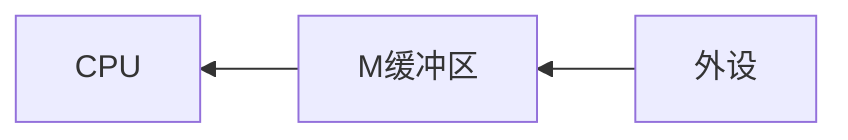

**先进先出算法（FIFO）**

`FIFO`算法选择在内存驻留时间最长的页面进行置换。算法实现需要维护一个队列，出现缺页时，选择队头页面进行置换，新页面加到队尾。`FIFO`算法实现简单，但是性能较差，调出的页面可能是经常访问的。


**最近最久未使用算法（LRU, Least Recently Used）**

`LRU`算法是对最优置换算法的近似，以过去推未来。根据程序的局部性原理，在最近一小段时间，如果某些页面被频繁访问，那么在将来的一小段时间内，它们还可能再一次被频繁访问。反之，如果在过去某些页面长时间未被访问，那么将来它们还可能会长时间地得不到访问。因此，`LRU`算法选择最长时间没有被引用的页面进行置换。

`LRU`算法的实现需要计算内存中每个逻辑页面的上一次访问时间，选择上一次使用到当前时间最长的页面。该算法可能达到最优的效果，但是维护这样的访问链表开销比较大。


**时钟页面置换算法（Clock）**

`Clock`页面置换算法是`LRU`的近似和对`FIFO`的改进。算法需要用到页表项的访问位（access bit），当一个页面被装入内存时，把该位初始化为$ 0 $，如果这个页被访问时把它置为$ 1 $。把各个页面组织成环形链表，把指针指向最老的页面（最先进来）。

当发生一个缺页中断，如果指针所指向的最老的页面的访问位为$ 0 $，则立即淘汰。若访问位为$ 1 $，则把该位置置为$ 0 $，然后指针往下移动一格。如此下去，直到找到被淘汰的页面，然后把指针移动到它的下一格。

例如按照$ \{1, 2, 3, 4\} $的顺序访问页面，则缓冲池会以这样的一种顺序被填满：


访问结束后，缓冲池已经被填满了。此时如果按照$ \{1, 2, 3, 4, 5\} $的顺序访问，那么在访问$ \{1, 2, 3, 4\} $的时候是可以直接命中缓存返回的，但是访问$ 5 $的时候，因为缓冲池已经满了，所以要进行一次逐出操作。


<div style="page-break-after: always;"></div>

# 第4章 设备管理

## 4.1 I/O重定向

**标准I/O**

程序对读入的数据进行处理，再输出数据。数据的输入（input）和输出（output）简称为`I/O`，在没有指定输入输出的情况下，默认为标准输入和标准输出。

打开的文件都有一个文件描述符（fd, file descriptor），表现为一个数字：

- 标准输入`stdin`（键盘）：fd = 0。 
- 标准输出`stdout`（显示器）：fd = 1。
- 标准错误输出`stderr`（显示器）：fd = 2。


---

【代码】标准I/O

```c
#include <stdio.h>

int main(int argc, char *argv[]) {
    int num;
    fscanf(stdin, "%d", &num);
    fprintf(stdout, "[stdout] num = %d\n", num);
    fprintf(stderr, "[stderr] This is an error message.\n");
    return 0;
}
```

> 运行结果

```
123
[STDOUT] num = 123
[STDERR] This is an error message.
```

---

【代码】文件I/O

```c
#include <stdio.h>
#include <stdlib.h>

void writeFile(const char *filename) {
    FILE *fp = fopen(filename, "w");
    if(!fp) {
        fprintf(stderr, "File open failed.\n");
        exit(1);
    }
    char *name = "小灰";
    int age = 17;
    double height = 182.3;
    fprintf(fp, "姓名：%s\n年龄：%d\n身高：%.2f\n", 
                name, age, height);
    fclose(fp);
}

void readFile(const char *filename) {
    FILE *fp = fopen(filename, "r");
    if(!fp) {
        fprintf(stderr, "File open failed.\n");
        exit(1);
    }
    char name[32];
    int age;
    double height;
    fscanf(fp, "姓名：%s\n年龄：%d\n身高：%lf\n", 
                name, &age, &height);
    printf("name: %s\n", name);
    printf("age: %d\n", age);
    printf("height: %.2f\n", height);
    fclose(fp);
}

int main(int argc, char *argv[]) {
    const char *filename = "info.txt";
    writeFile(filename);
    readFile(filename);
    return 0;
}
```

> 运行结果

```
name: 小灰
age: 17
height: 182.30
```

---


**I/O重定向（I/O Redirection）**

`I/O`重定向就是改变标准输入与输出的默认位置。标准输入默认是键盘，通过改成其它输入，就是输入重定向，例如从文本文件里输入。标准输出默认是显示器，通过改成其它输出，就是输出重定向，例如输出到文件。

输出重定向用`>`表示，若文件不存在，则创建；若文件已存在，则覆盖。使用`>>`时若文件不存在，则创建，若文件已存在，则追加。

错误输出重定向用`2>`和`2>>`表示。

输入重定向用`<`表示，但是在输入重定向中`<<`可不是表示输入追加。

---

【代码】I/O重定向

- io_redirection.c

```c
#include <stdio.h>

int main(int argc, char *argv[]) {
    int data;
    scanf("%d", &data);
    printf("data = %d\n", data);
    return 0;
}
```

- input.txt

```
12345
```

> 编译

```shell
gcc -Wall io_redirection.c -o io_redirection
```

> 命令行（Windows）

```shell
io_redirection < info.txt > output.txt
```

> 命令行（Linux）

```shell
./io_redirection < input.txt > output.txt
```

> 运行结果（output.txt）

```
num = 12345
```

---

<div style="page-break-after: always;"></div>

## 4.2 I/O控制方式

**I/O设备**

现代计算机系统总是配有各种类型的外部设备，除了显示器、键盘、打印机、磁带、磁盘外，又出现了光盘、绘图仪、图形数字化仪、鼠标器、激光打印机、声音输入输出设备等，种类繁多。不同外设之间的差异较大，因此I/O性能经常成为系统的瓶颈。

操作系统设备管理的目标包括：

1. 向用户提供使用外部设备的方便、统一的接口，按照用户的要求和设备的类型，控制设备工作，完成用户的输入输出请求。方便是指用户能独立于具体设备的复杂物理特性而方便地使用设备；统一是指对不同设备尽量能统一操作方式。方便和统一要求对用户屏蔽实现具体设备I/O操作的细节，呈现给用户的是一种性能理想化的、操作简便的逻辑设备。系统的这种性能亦称为设备的独立性（设备无关性）。
2. 充分利用中断技术、通道技术和缓冲技术，提高CPU与设备、设备与设备间的并行工作能力，充分利用设备资源，提高外部设备的使用效率。
3. 设备管理就是要保证在多道程序环境下，当多个进程竞争使用设备时，按照一定的策略分配和管理设备，以使系统能有条不紊地工作。


**I/O控制方式**

早期，计算机设计者没有将CPU的执行与I/O操作分开，甚至大多数人认为输入输出与计算的时间应该是同一数量级。后来，他们意识到，CPU要比I/O操作速度高几个数量级。于是，硬件和软件设计师开始寻找一种技术，使CPU计算可以不用等待I/O操作而持续执行。

I/O控制方式包括：

1. 程序控制I/O（Programmed I/O）：处理器代表一个进程给I/O模块发送一个I/O命令，该进程进入忙等待（busy waiting），直到操作完成。
2. 中断驱动I/O（Interrupt I/O）：处理器代表进程向I/O发送命令，如果来自进程的I/O指令是非阻塞的，那么处理器继续执行进程的后续指令。如果I/O指令时阻塞的，那么处理器执行来自操作系统的指令，将当前进程设置为阻塞态并且调度其它进程。
3. 直接存储器访问（DMA）：DMA模块控制内存和I/O模块之间的数据交换。为传送一块数据，处理器给DMA模块发送请求，只有当整个数据块传送结束后，它才能被中断。

<div style="page-break-after: always;"></div>

## 4.3 I/O缓冲

**I/O缓冲（I/O Buffering）**

在设备管理中，为了缓和CPU与I/O设备速度不匹配的矛盾，提高CPU与I/O设备的并行性、减少对CPU的中断频率，在I/O设备与处理机交换数据时都用到了缓冲区。

缓冲的种类包括：

1. 单缓冲：输入时通道先将数据送入缓冲区，CPU从缓冲区取数据处理。通道再送入后续数据，如此反复直到输入完成。输出情形正好相反。由于缓冲区属于互斥区，所以单缓冲并不能明显改善CPU与外部设备的并行性。



2. 双缓冲：分别设置输入缓冲区和输出缓冲区，CPU和通道可以分别访问两个缓冲区，即在CPU访问一个缓冲区的同时，通道可以访问另一个缓冲区。双缓冲只是一种说明设备和设备、CPU和设备并行操作的简单模型，并不能用于实际系统中的操作。因为计算机系统中的外围设备较多，另外双缓冲也很难匹配设备和处理机的处理速度。现代计算机系统一般使用多缓冲或缓冲池结构。


3. 多缓冲：把多个缓冲区连接起来组成两部分，一部分专门用于输入，另一部分专门用于输出的缓冲结构。常组织成循环队列的结构，也称为循环缓冲。


4. 缓冲池：把多个缓冲区连接起来统一管理，既可用于输入又可用于输出的缓冲结构。


<div style="page-break-after: always;"></div>

## 4.4 磁盘调度

**磁盘调度算法**

在多道程序系统中，各个进程可能会不断提出不同的对磁盘进行读/写操作的请求。由于有时候这些进程的发送请求的速度比磁盘响应的还要快，因此我们有必要为每个磁盘设备建立一个等待队列。磁盘调度算法的目的就是为了提高磁盘的访问性能，一般是通过优化磁盘的访问请求顺序来做到的。


假设有下面一个请求序列，每个数字代表磁道的位置：$ 98, 183, 37, 122, 14, 124, 65, 67 $。初始磁头当前的位置是在第$ 53 $磁道。


**先来先服务（FCFS, First Come First Served）**


`FCFS`算法比较简单粗暴，但是如果大量进程竞争使用磁盘，请求访问的磁道可能会很分散，那`FCFS`算法因为寻道时间过长，在性能上就会显得很差。


**最短寻道时间优先（SSTF, Shortest Seek Time First）**

`SSTF`算法优先选择从当前磁头位置所需寻道时间最短的请求。


但`SSTF`算法可能存在某些请求的饥饿，对用户的服务请求的响应机会不是均等的。磁头在一小块区域来回移动，因而导致响应时间的变化幅度很大，有些请求的响应时间将不可预期。


**扫描算法（SCAN）**

为了防止`SSTF`算法产生饥饿的问题，可以规定磁头在一个方向上移动，访问所有未完成的请求，直到磁头到达该方向上的最后的磁道，才调换方向。这种算法也叫做电梯调度算法，比如电梯保持按一个方向移动，直到在那个方向上没有请求为止，然后改变方向。


`SCAN`算法性能较好，不会产生饥饿现象，但是存在这样的问题：中间部分的磁道会比较占便宜，中间部分相比其它部分响应的频率会比较多，也就是说每个磁道的响应频率存在差异。


**循环扫描算法（CSCAN, Circular Scan）**

`CSCAN`算法规定只有磁头朝某个特定方向移动时，才处理磁道访问请求，而返回时直接快速移动至最靠边缘的磁道，也就是复位磁头，这个过程是很快的，并且返回中途不处理任何请求。


`CSCAN`算法的特点就是磁道只响应一个方向上的请求，相比于`SCAN`算法，对于各个位置磁道响应频率相对比较平均。

<div style="page-break-after: always;"></div>

## 4.5 RAID

**RAID（Redundant Array of Independent Disks）**

在单机时代，采用单块磁盘进行数据存储和读写的方式，由于寻址和读写的时间消耗，导致I/O性能非常低，且存储容量还会受到限制。另外，单块磁盘极其容易出现物理故障，经常导致数据的丢失。

1988年美国加州大学伯克利分校的D. A. Patterson教授等首次在论文*A Case of Redundant Array of Inexpensive Disks*中提出了`RAID`概念，即廉价冗余磁盘阵列（Redundant Array of Inexpensive Disks）。由于当时大容量磁盘比较昂贵，`RAID`的基本思想是将多个容量较小、相对廉价的磁盘进行有机组合，从而以较低的成本获得与昂贵大容量磁盘相当的容量、性能、可靠性。随着磁盘成本和价格的不断降低，“廉价”已经毫无意义。因此决定用Independent替代Inexpensive。于时RAID变成了独立磁盘冗余阵列（Redundant Array of Independent Disks），但这仅仅是名称的变化，实质内容没有改变。

RAID思想从提出后就广泛被业界所接纳，存储工业界投入了大量的时间和财力来研究和开发相关产品。随着处理器、内存、计算机接口等技术的不断发展，RAID不断地发展和革新，在计算机存储领域得到了广泛的应用，从高端系统逐渐延伸到普通的中低端系统。

RAID主要优势包括：

1. 大容量：扩大了磁盘的容量，由多个磁盘组成的RAID系统具有海量的存储空间。现在单个磁盘的容量就可以到1TB以上，这样RAID的存储容量就可以达到PB级，大多数的存储需求都可以满足。
2. 高性能：单个磁盘的I/O性能受到接口、带宽等计算机技术的限制，性能往往很有限，容易成为系统性能的瓶颈。通过数据条带化，RAID将数据I/O分散到各个成员磁盘上，从而获得比单个磁盘成倍增长的聚合I/O性能。
3. 可靠性：RAID冗余技术大幅提升数据可用性和可靠性，保证了若干磁盘出错时，不会导致数据的丢失，不影响系统的连续运行。


**RAID0**

RAID0是一种简单的、无数据校验的数据条带化技术，将所在磁盘条带化后组成大容量的存储空间，将数据分散存储在所有磁盘中，以独立访问方式实现多块磁盘的并读访问。

RAID0具有低成本、高读写性能，但是它不提供数据冗余保护，一旦数据损坏，将无法恢复。因此，RAID0一般适用于对性能要求严格但对数据安全性和可靠性不高的应用，如视频、音频存储、临时数据缓存空间等。


**RAID1**

RAID1称为镜像，它将数据完全一致地分别写到工作磁盘和镜像磁盘，它的磁盘空间利用率为50%。RAID1在数据写入时，响应时间会有所影响，但是读数据的时候没有影响。RAID1提供了最佳的数据保护，一旦工作磁盘发生故障，系统自动从镜像磁盘读取数据，不会影响用户工作。RAID1拥有完全容错的能力，但实现成本高。


**RAID2**

RAID2称为纠错海明码磁盘阵列，其设计思想是利用海明码实现数据校验冗余。海明码是一种在原始数据中加入若干校验码来进行错误检测和纠正的编码技术。海明码自身具备纠错能力，因此RAID2可以在数据发生错误的情况下对纠正错误，保证数据的安全性。

但是海明码的数据冗余开销太大，而且RAID2的数据输出性能受阵列中最慢磁盘驱动器的限制。并且海明码是按位运算，RAID2数据重建非常耗时。因此RAID2在实际中很少应用，没有形成商业产品。


**RAID3**

RAID3是使用专用校验盘的并行访问阵列，它采用一个专用的磁盘作为校验盘，其余磁盘作为数据盘。不同磁盘上同一带区的数据作XOR校验，校验值写入校验盘中。RAID3完好时读性能与RAID0完全一致，并行从多个磁盘条带读取数据，性能非常高，同时还提供了数据容错能力。如果RAID3中某一磁盘出现故障，不会影响数据读取，可以借助校验数据和其他完好数据来重建数据。

RAID3只需要一个校验盘，阵列的存储空间利用率高，再加上并行访问的特征，能够为高带宽的大量读写提供高性能，适用大容量数据的顺序访问应用，如影像处理、流媒体服务等。


**RAID4**

RAID4与RAID3的原理大致相同，区别在于条带化的方式不同。RAID4按照块的方式来组织数据，保证单块的完整性，可以避免受到其他磁盘上同条带产生的不利影响。


**RAID5**

RAID5应该是目前最常见的RAID等级，它的原理与RAID4相似，区别在于校验数据分布在阵列中的所有磁盘上，而没有采用专门的校验磁盘。因此，RAID5不存在RAID4中的并发写操作时的校验盘性能瓶颈问题。

RAID5的磁盘上同时存储数据和校验数据，数据块和对应的校验信息存保存在不同的磁盘上，当一个数据盘损坏时，系统可以根据同一条带的其他数据块和对应的校验数据来重建损坏的数据。

RAID5 兼顾存储性能、数据安全和存储成本等各方面因素，是目前综合性能最佳的数据保护解决方案。RAID5基本上可以满足大部分的存储应用需求，数据中心大多采用它作为应用数据的保护方案。


<div style="page-break-after: always;"></div>

# 第5章 文件系统

## 5.1 文件操作

**打开文件**

计算机除了拥有计算的能力之外，一定要有数据的存储能力，而对于数据的存储一般就可以通过文件的形式来完成。在Python中直接提供有文件的`I/O (Input/Output)`处理函数操作，利用这些函数可以方便地实现读取和写入。

`open()`函数的功能是进行文件的打开，在进行文件打开的时候如果不设置任何的模式类型，则默认为`r（只读模式）`。

```python
def open(
    file, mode='r', buffering=None, encoding=None,
    errors=None, newline=None, closefd=True
)
```

| 模式 | 描述                                           |
| :--: | ---------------------------------------------- |
|  r   | 使用只读模式打开文件，此为默认模式             |
|  w   | 写模式，如果文件存在则覆盖，文件不存在则创建   |
|  x   | 写模式，新建一个文件，如果该文件已存在则会报错 |
|  a   | 内容追加模式                                   |
|  b   | 二进制模式                                     |
|  t   | 文本模式（默认）                               |
|  +   | 打开一个文件进行更新（可读可写）               |

如果以只读的模式打开文件，并且文件路径不存在的话，就会出现`FileNotFoundError`的错误信息。

---

【代码】文件操作

```python
def main():
    file = open(file="data.txt", mode="w")
    print("文件名称：%s" % file.name)
    print("访问模式：%s" % file.mode)
    print("文件状态：%s" % file.closed)
    print("关闭文件...")
    file.close()
    print("文件状态：%s" % file.closed)

if __name__ == "__main__":
    main()
```

> 运行结果

```
文件名称：data.txt
访问模式：w
文件状态：False
关闭文件...
文件状态：True
```

---


**文件读写**

当使用`open()`打开一个文件之后，接下来可以使用创建的文件对象进行读写操作。

| 方法                                      | 描述                                                         |
| ----------------------------------------- | ------------------------------------------------------------ |
| def close(self)                           | 关闭文件资源                                                 |
| def fileno(self)                          | 获取文件描述符，返回内容为：0（标准输入stdin）、1（标准输出stdout）、2（标准错误stderr）、其它数字（映射打开文件的地址） |
| def flush(self)                           | 强制刷新缓冲区                                               |
| def read(self, n: int = -1)               | 数据读取，默认读取全部内容，也可以设置读取个数               |
| def readlines(self, hint: int = -1)       | 读取所有数据行，并以列表的形式返回                           |
| def readline(self, limit: int = -1)       | 读取每行数据（`\n`为结尾），也可以设置读取个数               |
| def truncate(self, size: int = None)      | 文件截取                                                     |
| def writable(self)                        | 判断文件是否可以写入                                         |
| def write(self, s: AnyStr)                | 文件写入                                                     |
| def writelines(self, lines, List[AnyStr]) | 写入一组数据                                                 |

既然所有的文件对象最终都需要被开发者关闭，那么可以结合`with`语句实现自动的关闭处理。通过`with`实现所有资源对象的连接和释放是在Python中编写资源操作的重要技术手段，通过这样的操作可以极大地减少和优化代码结构。

使用读模式打开文件后，可以使用循环读取每一行的数据内容。Python在进行文件读取操作的时候也可以进一步简化操作。文件对象本身是可以迭代的，在迭代的时候是以换行转义字符`\n`为主进行分割，每次迭代就读取到一行数据内容。

---

【代码】读取文件

- data.txt

```
小灰	16
小白	17
小黄	21
```

- read_file.py

```python
def main():
    with open(file="data.txt", mode="r", encoding="utf-8") as file:
        for line in file:
            print(line, end='')

if __name__ == "__main__":
    main()
```

> 运行结果

```
小灰	16
小白	17
小黄	21
```

---

【代码】写入文件

```python
def main():
    with open(file="data.txt", mode="w", encoding="utf-8") as file:
        info = {"小灰": 16, "小白": 17, "小黄": 21}
        for name, age in info.items():
            file.write("%s\t%d\n" % (name, age))

if __name__ == "__main__":
    main()
```

> 【data.txt】文件内容

```
小灰	16
小白	17
小黄	21
```

---

<div style="page-break-after: always;"></div>

## 5.2 文件缓冲

**文件缓冲**

在使用`open()`创建一个文件对象的时候，默认情况下是不会启用缓冲的。在`open()`中提供的`buffering`参数描述的就是文件处理缓冲的定义，在进行文件写入的时候利用缓冲可以避免频繁的I/O资源占用。


开启缓冲可以提高写入效率，`buffering`参数设置有3种类型：

1. 全缓冲（`buffering > 1`）：当标准I/O缓存被填满后才会进行真正I/O操作，全缓冲的典型代表就是对磁盘文件的读写操作。
2. 行缓冲（`buffering = 1`）：在I/O操作中遇见换行符时才执行真正的I/O操作，例如在使用网络聊天工具时所编辑的文字在没有发送前是不会进行I/O操作的。
3. 不缓冲（`buffering = 0`）：直接进行终端设备的I/O操作，数据不经过缓冲保存。

如果想要观察到行缓冲的使用特点，就不能直接使用`with`语句，因为`with`最后会执行`close()`的关闭操作，而一旦关闭，则缓冲的内容会全部进行输出。

使用`flush()`方法进行缓冲区的强制清空，一旦强制清空之后，缓冲区的内容将全部输出。每次使用`close()`方法关闭文件流的时候默认情况下也会调用`flush()`方法进行缓冲区的清空处理。

---

【代码】文件缓冲

```python
import os

def main():
    file = open(file="data.txt", mode="w", encoding="utf-8", buffering=1)
    file.write("This is a test.")
    os.system("pause")  # 程序暂停
    file.flush()        # 强制清空缓冲区
    os.system("pause")  # 程序暂停
    file.close()

if __name__ == "__main__":
    main()
```

> 【data.txt】文件内容

```
This is a test.
```

---

<div style="page-break-after: always;"></div>

## 5.3 文件系统

**文件系统**

文件系统是OS中负责管理持久数据的子系统，也就是负责把用户的文件存到磁盘硬件中，即使计算机断电了，磁盘里的数据并不会丢失，所以可以持久化地保存文件。文件系统的基本数据单位是文件，它的目的是对磁盘上的文件进行组织管理。

Linux最经典的一句话是`一切皆文件`，不仅普通的文件和目录，就连块设备、管道、socket等，也都是统一交给文件系统管理的。

文件和目录是按照层次关系管理的，这种结构可以用树表示。


文件夹中包含了子文件夹或者文件，这样就形成了一个树的结构。不过也有一些特殊情况，例如团队在协同工作时会共享一些信息，两个人有着不同的目录，但是可以共享同一份文件。

Linux文件系统会为每个文件分配索引结点（inode）和目录项（directory entry）这两个数据结构。索引结点用来记录文件的元信息，比如inode编号、文件大小、访问权限、创建时间、修改时间、数据在磁盘的位置等。目录项用来记录文件的名字、索引结点指针以及与其它目录项的层级关联关系。多个目录项关联起来，就会形成目录结构，但它与索引结点不同的是，目录项是由内核维护的一个数据结构，不存放于磁盘，而是缓存在内存。

由于索引结点唯一标识一个文件，而目录项记录着文件名，所以目录项和索引结点的关系是多对一。也就是说，一个文件可以有多个别名，例如，硬链接的实现就是多个目录项中的索引结点指向同一个文件。


**硬链接与软链接**

链接简单说实际上是一种文件共享的方式，主流文件系统都支持链接文件。链接简单地理解为Windows中常见的快捷方式，Linux中常用它来解决一些库版本的问题，通常也会将一些目录层次较深的文件链接到一个更易访问的目录中。

链接分为硬链接（hard link）和软链接（symbolic link）。从使用的角度讲，两者没有任何区别，都与正常的文件访问方式一样，支持读写，如果是可执行文件的话也可以直接执行。

硬链接通过同一个inode指向原始文件，软链接通过硬盘媒介中的描述指向原始文件。但是，当原始文件的位置发生改变后，inode不会改变，所以硬链接还是正确的，而软链接就无法访问了。


<div style="page-break-after: always;"></div>

## 5.4 文件存储

**文件存储**

文件的数据是要存储在硬盘上面的，数据在磁盘上的存放方式，就像程序在内存中存放的方式那样，分为连续空间存放和非连续空间存放两种方式。不同的存储方式有各自的特点，它们的存储效率和读写性能各不相同。


**顺序分配**

连续空间存放方式顾名思义，文件存放在磁盘连续的物理空间中。这种模式下，文件的数据都是紧密相连，读写效率很高，因为一次磁盘寻道就可以读出整个文件。

使用连续存放的方式有一个前提，必须先知道一个文件的大小，这样文件系统才会根据文件的大小在磁盘上找到一块连续的空间分配给文件。所以文件头里需要指定起始块的位置和长度，有了这两个信息就可以很好地表示文件存放方式是一块连续的磁盘空间。


连续空间存放的方式虽然读写效率高，但是有磁盘空间碎片和文件长度不易扩展的缺陷。


**链表分配**

链表的方式存放是离散的，于是就可以消除磁盘碎片，可大大提高磁盘空间的利用率，同时文件的长度可以动态扩展。根据实现的方式的不同，链表可分为隐式链表和显式链接两种形式。

隐式链表实现的方式是文件头要包含第一块和最后一块的位置，并且每个数据块里面留出一个指针空间，用来存放下一个数据块的位置，这样从链头开始就可以顺着指针找到所有的数据块，所以存放是不连续的。


隐式链表存放方式的缺点在于无法直接访问数据块，只能通过指针顺序访问，以及数据块指针消耗了一定的存储空间。隐式链表稳定性较差，系统在运行过程中由于软件或者硬件错误导致指针丢失或损坏，会导致文件数据的丢失。

如果取出每个磁盘块的指针，把它放在内存的一个表中，就可以解决上述隐式链表的两个不足。显式链接指把用于链接文件各数据块的指针，显式地存放在内存的一张链接表中，该表在整个磁盘仅设置一张，每个表项中存放链接指针，指向下一个数据块号。这个表格称为文件分配表（FAT, File Allocation Table）。


**索引分配**

链表的方式解决了连续分配的磁盘碎片和文件动态扩展的问题，但是不能有效支持直接访问，索引的方式可以解决这个问题。索引的实现是为每个文件创建一个索引数据块，里面存放的是指向文件数据块的指针列表，类似于书的目录，通过目录就可以找到对应章节。文件头需要包含指向索引数据块的指针，这样就可以通过文件头知道索引数据块的位置，再通过索引数据块里的索引信息找到对应的数据块。


索引的方式优点在于：

1. 文件的创建、增大、缩小很方便。
2. 不会有碎片的问题。
3. 支持顺序读写和随机读写。

如果文件很大，大到一个索引数据块放不下索引信息，这时可以通过链表与索引的组合，这种组合称为链式索引块，它的实现方式是在索引数据块留出一个存放下一个索引数据块的指针，于是当一个索引数据块的索引信息用完了，就可以通过指针的方式，找到下一个索引数据块的信息。


<div style="page-break-after: always;"></div>

## 5.5 空闲空间管理

**空闲空间管理**

文件的存储是针对已经被占用的数据块的组织和管理，如果要保存一个数据块，应该放在硬盘上的哪个位置呢？如果将所有的块扫描一遍寻找一个空闲空间，这种方式效率太低了，所以针对磁盘的空闲空间也要引入管理的机制。


**空闲表法**

空闲表法就是为所有空闲空间建立一张表，表内容包括空闲区的第一个块号和该空闲区的块个数。注意，这个方式是连续分配的。


当请求分配磁盘空间时，系统依次扫描空闲表里的内容，直到找到一个合适的空闲区域为止。当用户撤销一个文件时，系统回收文件空间。这时，也需顺序扫描空闲表，寻找一个空闲表条目并将释放空间的第一个物理块号及它占用的块数填到这个条目中。

这种方法仅当有少量的空闲区时才有较好的效果，因为如果存储空间中有着大量的小的空闲区，则空闲表变得很大，这样查询效率会很低。另外，这种分配技术适用于建立连续文件。


**空闲链表法**

除了空闲表，也可以使用链表的方式来管理空闲空间，每一个空闲块里有一个指针指向下一个空闲块，这样也能很方便的找到空闲块并管理起来。当创建文件需要一块或几块时，就从链头上依次取下一块或几块。反之，当回收空间时，把这些空闲块依次接到链头上。


这种技术只要在主存中保存一个指针，令它指向第一个空闲块。其特点是简单，但不能随机访问，工作效率低，因为每当在链上增加或移动空闲块时需要做很多I/O操作，同时数据块的指针消耗了一定的存储空间。

空闲表法和空闲链表法都不适合用于大型文件系统，因为这会使空闲表或空闲链表太大。


**位图法（Bit Table）**

位图是利用二进制的一位来表示磁盘中一个盘块的使用情况，磁盘上所有的盘块都有一个二进制位与之对应。当值为0时，表示对应的盘块空闲，值为1时，表示对应的盘块已分配。Linux文件系统就采用了位图的方式来管理空闲空间。
