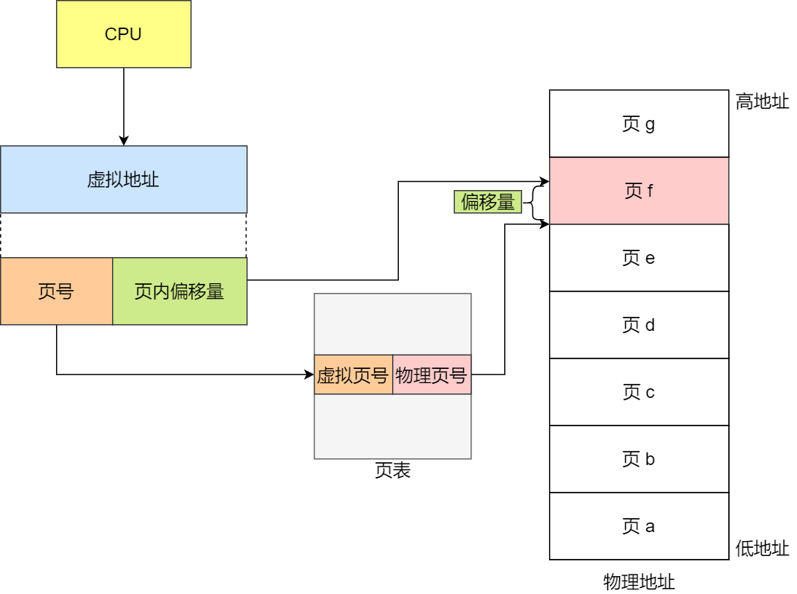
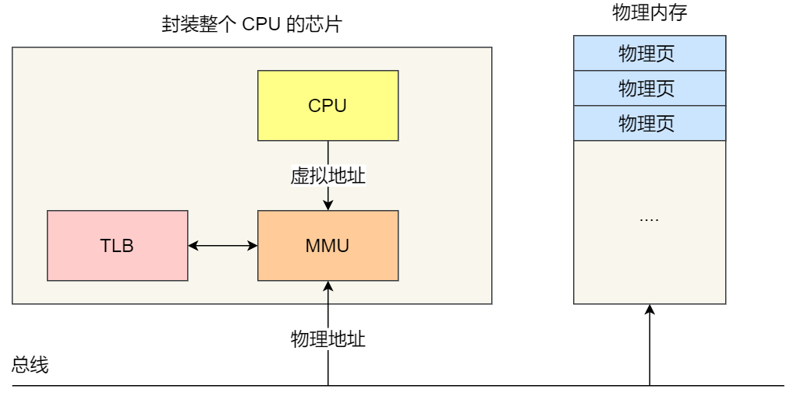

<center><h1>操作系统</h1></center>

<div style="border-bottom: none;"><center><h3>目录</h3></center></div>

[TOC]

<div style="page-break-after: always;"></div>

# 第1章 操作系统

## 1.1 操作系统

**操作系统（Operating System）**

现代的计算机离不开操作系统（OS），操作系统是最基本也是最为重要的基础性系统软件。


在计算机结构中，最底层的是计算机硬件，硬件之上就是操作系统。操作系统是运行在硬件上的第一层软件，它扩展了硬件的功能。但是光有操作系统是不满足的还需要增加新的一些工具，例如开发工具和开发平台等，所以操作系统需要支持用户的程序开发。

计算机结构中用户主要分为三大类：

- 面向硬件的用户被称为操作系统设计者，需要熟知硬件的运行机制，以及如何在上面进行系统开发。
- 在操作系统纸上进行程序设计的用户被称为程序员，程序员有两种类型，一种是基于操作系统的程序设计，另一种是基于开发平台的程序设计。
- 终端用户（end user）直接使用应用程序。


**操作系统观点**

现代操作系统主要有四种基本观点：

1. 普通用户：OS是计算机用户使用计算机系统的接口，它为计算机用户提供而方便的工作环境。


2. 程序员：OS是建立在计算机硬件平台上的虚拟机器，它为应用软件提供了许多比计算机硬件功能更强或计算机硬件所没有的功能。
3. OS开发者：OS是计算机系统中各类资源的管理者，它负责分配、回收以及控制操作系统中的软硬件资源（包括CPU、内存、I/O设备、文件、网络）。
4. OS开发者：OS是计算机系统工作流程的组织者，它负责协调在系统中运行的各个应用软件的运行次序。


<div style="page-break-after: always;"></div>

## 1.2 OS功能性与非功能性需求

**功能性需求**

OS的功能性需求主要有两大类：

1. 用户命令：计算机用户需要使用用户命令进行操作，由OS实现的所有用户命令所构成的集合被称为OS的接口（interface）。
2. 系统调用（system call）：应用软件需要使用系统调用来实现OS所提供的服务，由OS实现的所有系统调用所构成的集合被称为应用编程接口（API, Application Programming Interface）。


**非功能性需求**

OS的非功能性需求主要包括：

1. 性能 / 效率（performance / efficiency）：最大化系统吞吐量（throughput）、最小化响应时间（response time），在分时系统情况下需要满足尽量多的用户。
2. 公平性（fairness）：OS中的算法不能偏向于某些特定类型的进程，但是在某些时候，如实时系统需要及时响应外部事件。
3. 可靠性（reliability）
4. 安全性（security）
5. 可伸缩性（scalability）：不同预算可购买不同配置，如个人版和企业版。
6. 可扩展性（extensibility）：OS能够适应新的外部设备的增长。
7. 可移植性（portability）：不能仅限于某一个平台或某一个厂家生产的硬件设备。

<div style="page-break-after: always;"></div>

## 1.3 CPU

**中央处理器（CPU, Central Process Unit）**

CPU作为计算机系统的运算和控制核心，是信息处理、程序运行的最终执行单元。


Python中可以通过`multiprocessing`模块获取计算机CPU的内核数量。

---

【代码】获取当前CPU内核数量

```python
import multiprocessing	# 导入多进程模块
# 获取CPU的可用数量
print("CPU内核数量：%d" % multiprocessing.cpu_count())
```

---

CPU的核心部分有：

- 控制单元（CU, Control Unit）：控制单元是CPU的子部件，它管理着计算机中所有在这一区域执行的操作。它负责从计算机、指令和数据中获取各种输入，并告诉处理器如何处理它们。
- 算术逻辑单元（ALU, Arithmetic and Logic Unit）：实现多组算术运算和逻辑运算的组合逻辑电路。
- 寄存器（register）：寄存器是有限存贮容量的高速存贮部件，它们可用来暂存指令、数据和地址。

大多数现代处理器的工作原理是`取指令-译码-执行（Fetch-Decode-Execute Cycle）`，也被称为冯·诺依曼架构（Von Neumann Architecture）。


Python中`psutil`模块也提供了系统硬件的内容获取。

---

【代码】获取系统硬件信息

```python
import psutil

def main():
    # CPU信息
    print("【CPU】物理数量：%d" % psutil.cpu_count(logical=False))
    print("【CPU】逻辑数量：%d" % psutil.cpu_count(logical=True))
    print("【CPU】用户用时：%f" % psutil.cpu_times().user)
    print("【CPU】系统用时：%f" % psutil.cpu_times().system)
    print("【CPU】空闲时间：%f" % psutil.cpu_times().idle)

if __name__ == "__main__":
    main()
```

---

<div style="page-break-after: always;"></div>

## 1.4 中断

**中断（Interrupt）**

中断是指计算机运行过程中，出现某些意外情况需主机干预时，机器能自动停止正在运行的程序并转入处理新情况的程序，处理完毕后又返回原被暂停的程序继续运行。

中断包括鼠标移动、鼠标点击、键盘按键、打印机打印等。

现代计算机中采用中断系统的主要目的是：

1. 提高计算机系统效率：计算机系统中处理机的工作速度远高于外围设备的工作速度，通过中断可以协调它们之间的工作。当外围设备需要与处理机交换信息时，由外围设备向处理机发出中断请求，处理机及时响应并作相应处理。
2. 维持系统可靠正常工作：程序员不能直接干预和操纵机器，必须通过中断系统向操作系统发出请求，由操作系统来实现人为干预。在程序运行过程中，如出现越界访问，有可能引起程序混乱或相互破坏信息。为避免这类事件的发生，由存储管理部件进行监测，一旦发生越界访问，向处理机发出中断请求，处理机立即采取保护措施。
3. 满足实时处理要求：在实时系统中，各种监测和控制装置随机地向处理机发出中断请求，处理机随时响应并进行处理。
4. 提供故障现场处理手段：处理机中设有各种故障检测和错误诊断的部件，一旦发现故障或错误，立即发出中断请求，进行故障现场记录和隔离，为进一步处理提供必要的依据。

<div style="page-break-after: always;"></div>

## 1.5 存储器

**存储单位**

计算机存储单位一般使用bit (b)、B、KB、MB、GB、TB、PB、EB、ZB、YB、BB、NB、DB等符号来表示。

位（bit）是计算机最小的存储单位，只存放一位二进制数。

一个字节（byte）为8位二进制数，保存一个英文字母需要一个字节，但保存一个中文需要两个字节字（word）。


有些硬盘厂商以1000进制为单位，这并不是故意弄虚作假，而是为了设计和制造的方便，直接以1000计算更方便。


**存储设备**

存储设备是用于储存信息的设备，通常是将信息数字化后再以利用电、磁或光学等方式的媒体加以存储。


**内存缓存（Memory Cache）**

CPU缓存是位于CPU与内存之间的临时存储器，它的容量比内存小的多但是交换速率却比内存要快得多。缓存的出现主要是为了解决CPU运算速率与内存读写速率不匹配的矛盾，因为CPU运算速率要比内存读写速率快很多，这样会使CPU花费很长时间等待数据到来或把数据写入内存。在缓存中的数据是内存中的一小部分，但这一小部分是短时间内CPU即将访问的，当CPU调用大量数据时，就可避开内存直接从缓存中调用，从而加快读取速率。


<div style="page-break-after: always;"></div>

## 1.6 操作系统演变

**操作系统演变**

操作系统一直在不断地更新版本，版本升级就是操作系统的改变。操作系统改变的原因包括修复漏洞、支持新的服务、硬件升级、提升性能等。


**串行处理（Serial Processing）**

这个时期的计算机体积非常大，因为没有操作系统，所以操作的时候需要通过扳动按钮，最终通过灯来进行显示。这种计算机必须全部由专家操作，一般用户是用不了这台计算机的。


这就导致了两个主要的问题：

1. 调度低效：机器需要等待人扳动按钮，浪费时间。
2. 启动时间慢：没有自动化，需要手工装入编译器、源程序、保存中间代码等。


**单道批处理系统（Simple Batch System）**

单道批处理系统可以说是第一代操作系统，在外存中可以有一批作业等待，当内存没有作业可运行的时候，Monitor就会从外存去选一个作业进入内存。最简单选择方式就是按队列顺序选择，但这不一定是最合理的，这就涉及到了调度算法。


**多道程序系统（Multiprogramming）**

一个支持Multiprogramming的系统允许多道程序同时准备运行。当正在运行的那道程序因为某种原因（比如等待输入或输出数据）暂时不能继续运行时，系统将自动地启动另一道程序运行。一旦原因消除（比如数据已经到达或数据已经输出完毕），暂时停止运行的那道程序在将来某个时候还可以被系统重新启动继续运行。


**并发编程（Concurrent）**

并发编程是一种有效提高操作系统（服务器）性能的技术手段，现代的操作系统之中最为重要的代表就是并发性，例如现在的CPU都属于多核CPU。

早期的`DOS`操作系统有一个非常重要的特征：一旦系统沾染了病毒，那么所有的程序就无法直接执行了。因为传统的`DOS`系统属于单进程模型，在同一个时间段上只能运行一个程序，病毒程序运行了，其它程序自然就无法运行。

后来到了`Windows`操作系统，即便有病毒，也可以正常执行。这采用的是多进程的编程模型，同一时间段上可以同时运行多个程序。


只要打开`Windows`的任务管理器，就可以直接清楚发现所有正在执行的并行进程。


在早期的硬件系统之中由于没有多核CPU的设计，利用时间片的`轮转算法（Round Robin）`，保证在同一个时间段可以同时执行多个进行，但是在某一个时间点上只允许执行一个进程，可以实现资源的切换。


服务器的硬件性能是有限的，但是对于大部分的程序来讲都属于过剩的状态。于是如果按照传统的单进程模式来运行程序，所有的硬件资源几乎都会被浪费。


**分时系统（Time-Sharing System）**

分时系统首先是个多道系统，分时在多道的基础上对每个任务以时间为固定切片，时间到了就切换到下一个任务。这种系统非常适合于交互式系统，例如访问网络服务器，采用时间片轮转的方式同时为几十个、几百个用户服务。


分时系统会有一些问题，比如时间片太短会频繁的中断，造成很大的系统开销，或者有些任务不能被中断，被中断后可能恢复不了。所以分时系统是在某些需求的环境下才会提供。


**移动系统（Mobile System）**

移动设备体积小，可以手持便于携带。移动设备一般都具有LED平板界面，提供数字化按钮和键盘的触摸屏界面。移动设备操作系统的例子包括`Apple iOS`、`Google Android`、`Research in Motion’s BlackBerry OS`等。


<div style="page-break-after: always;"></div>

# 第2章 进程管理

## 2.1 进程

**进程（Process）**

Windows任务管理器提供了有关计算机性能的信息，并显示了计算机上所运行的程序和进程的详细信息。


进程指的是一个具有一定独立功能的程序关于某个数据集合的一次运行活动。进程是系统进行资源分配和调度运行的基本单位。进程实体中包含三个组成部分：

1. 程序
2. 数据
3. 进程控制块（PCB, Process Control Block）

程序（program）与进程是有区别的，程序是静态的，进程是动态的。当程序的可执行文件被装入内存后就会变成进程。进程可以认为是执行中的程序，进程需要一定资源（如CPU时间、内存、文件、I/O设备）完成任务。这些资源可以在创建的时候或者运行中分配。一个程序可以通过GUI（Graphic User Interface）图形用户界面的鼠标点击、CLI（Command-line Interface）命令行界面输入程序名等方式运行。


**进程内存分配**

一个进程通常包括了栈区（stack）、堆区（heap）、数据区、程序代码区：

- 栈区：由编译器自动分配和释放，存放函数的参数值、局部变量的值等。
- 堆区：一般由程序员分配和释放，若程序员不释放，程序结束后被OS回收。
- 数据区：存放全局变量和静态变量，程序结束后由系统释放。
- 程序代码区：存放函数体的二进制代码。


**进程状态模型**

在两状态进程模型中，进程被分为运行态（running）和非运行态（not-running）。


并非所有进程只要是非运行态就一定处于就绪状态，有的需要阻塞等待I/O完成。因此非运行态又可分为就绪态（ready）和阻塞态（block）。

所有的进程从其创建到销毁都有各自的生命周期，进程要经过如下几个阶段：


1. 创建状态：系统已经为其分配了PCB（可以获取进程的而信息），但是所需要执行的进程的上下文环境（context）还未分配，所以这个时候的进程还无法被调度。
2. 就绪状态：该进程已经分配到除CPU之外的全部资源，并等待CPU调度。
3. 执行状态：进程已获得CPU资源，开始正常提供服务。
4. 阻塞状态：所有的进程不可能一直抢占CPU，依据资源调度的算法，每一个进程运行一段时间之后，都需要交出当前的CPU资源，给其它进程执行。
5. 终止状态：某一个进程达到了自然终止的状态，或者进行了强制性的停止，那么进程将进入到终止状态，进程将不再被执行。


**多进程**

Python中在进行多进程开发的时候可以使用`multiprocessing`模块进行多进程的编写，这个模块内容提供有一个`Process`类，利用这个类可以进行多进程的定义。所有的Python程序执行都是通过主进程开始的，所有通过`Process`定义的进程都属于子进程。

---

【代码】创建多进程

```python
import multiprocessing

def worker():
    """
        进程处理函数
    """
    print("【进程】id：%d，名称：%s" % (
        multiprocessing.current_process().pid,
        multiprocessing.current_process().name))

def main():
    print("【主进程】id：%d，名称：%s" % (
        multiprocessing.current_process().pid,
        multiprocessing.current_process().name))
    
    # 创建3个进程
    for i in range(3):
        process = multiprocessing.Process(
            target=worker, name="进程%d" % i
        )
        process.start()

if __name__ == "__main__":
    main()
```

> 运行结果

```
【主进程】id：4476，名称：MainProcess
【进程】id：14216，名称：进程0
【进程】id：1424，名称：进程1
【进程】id：16636，名称：进程2
```

---

`psutil`是一个进程管理的第三方模块，该模块可以跨平台（Linux、UNIX、MaxOS、Windows都支持）地进行进程管理，可以极大地简化不同系统中的进程处理操作。

---

【代码】获取全部进程信息

```python
import psutil

def main():
    # 获取全部进程
    for process in psutil.process_iter():
        print("【进程】id：%d，名称：%s，创建时间：%s" % (
            process.pid, process.name, 
            process.create_time()))

if __name__ == "__main__":
    main()
```

---

<div style="page-break-after: always;"></div>

## 2.2 进程控制块PCB

**PCB（Process Control Block）**

进程控制块`PCB`是OS控制和管理进程时所用的基本数据结构，`PCB`是相关进程存在于系统中的唯一标志，系统根据`PCB`而感知相关进程的存在。

`PCB中`包含了关于进程的一些信息，如进程标识（`pid`）、程序计数器、状态信息、CPU调度信息、内存管理信息、I/O状态信息等。

Linux中C语言`<linux/sched.h>`头文件中定义的进程结构如下：

```c
pid t_pid;                  /* process identifier */
long state;                 /* state of the process */
unsigned int time_slice;    /* scheduling information */
struct task_struct *parent; /* this process’s parent */
struct list_head children;  /* this process’s children */
struct files_struct *files; /* list of open files */
struct mm_struct *mm;       /* address space of this process */
```


**进程切换**

当CPU切换到另一个进程时，系统必须保存当前执行进程的上下文（context），并且加载需要被执行进程的上下文。进程的上下文都被保存在`PCB`中。


<div style="page-break-after: always;"></div>

## 2.3 线程

**线程（Thread）**

60年代，在OS中能拥有资源和独立运行的基本单位是进程，然而随着计算机技术的发展，进程出现了很多弊端。由于进程是资源拥有者，创建、撤消与切换存在较大的时空开销。因此在80年代，出现了能独立运行的基本单位`线程`。

线程是操作系统进行运算调度的最小单位，它被包含在进程中，是进程中的实际运作单位。一个进程中可以并发多个线程，每条线程并行执行不同的任务。


由于线程比进程更小，基本上不拥有系统资源，故对它的调度所付出的开销就会小得多，能更高效的提高系统内多个程序间并发执行的程度，从而显著提高系统资源的利用率和吞吐量。因此使用线程可以带来很多好处：

- 创建一个线程相比创建一个进程花费更少的时间。
- 结束一个线程相比结束一个进程花费更少的时间。
- 在同一个进程中切换不同线程花费更少的时间。
- 线程与资源分配无关，它属于某一个进程，与进程内其它线程一起共享进程资源。


**子进程（Child Process）**

`fork()`函数是`UNIX`或`类UNIX`中的分叉函数，`fork()`函数将运行着的程序分成两个几乎完全一样的进程，每个进程都启动一个从代码的同一位置开始执行的线程。这两个进程中的线程继续执行，就像是两个用户同时启动了该应用程序的两个副本。

---

【代码】创建子进程

```c
#include <stdio.h>
#include <sys/types.h>
#include <wait.h>
#include <unistd.h>

int main() {
    pid_t pid;

    pid = getpid();
    printf("Before fork(): pid is %d\n", pid);

    // fork a child process
    pid = fork();

    if(pid < 0) {               // error
        fprintf(stderr, "Fork failed.\n");
        return 1;
    } else if(pid == 0) {       // child process
        printf("Child process: pid is %d\n", getpid());
        execlp("/bin/ls", "ls", NULL);
    } else {                    // parent process
        printf("Parent process: pid is %d\n", getpid());
        wait(NULL);
        printf("Child completed.");
    }
    
    return 0;
}
```

> 运行结果

```
Before fork(): my pid is 2250
Parent Process: my pid is 2250
Child Process: my pid is 2251
main main.c
Child Complete
```


---

正常情况下，子进程由父进程创建，子进程可以再创建新的进程。父子进程是一个异步过程，父进程永远无法预测子进程的结束，所以，当子进程结束后，它的父进程会调用`wait()`或`waitpid()`取得子进程的终止状态，回收掉子进程的资源。

但是一些情况下会产生僵尸进程（zoobie process）和孤儿进程（orphan process）的情况：

- 僵尸进程：子进程退出了，但是父进程没有用`wait()`或`waitpid()`去获取子进程的状态信息，那么子进程的进程描述符仍然保存在系统中，这种进程称为僵尸进程。
- 孤儿进程：父进程结束了，而它的一个或多个子进程还在运行，那么这些子进程就成为了孤儿进程。子进程的资源由`init`进程（`pid=1`）回收。

<div style="page-break-after: always;"></div>

## 2.4 进程调度

**进程调度（Scheduling）**

1. 短程调度（STS, Short Term Scheduling）：从准备队列中选择进程送到CPU执行。
2. 中程调度（MTS, Medium Term Scheduling）：从将外存中挂起的进程中选择进程送到内存。
3. 长程调度（LTS, Long Term Scheduling）：从外存中选择一个作业送到内存中，为其创建进程，并加入准备队列。


**调度准则（Scheduling Criteria）**

调度的基本准则分为面向用户和面向系统两方面。

面向用户准则包括：

1. 响应时间（response time）快：一般采用响应时间作为衡量调度算法的重要准则之一。从用户角度看，调度策略应尽量降低响应时间，使响应时间处在用户能接受的范围之内。
2. 周转时间（turnaround time）短：周转时间是指从作业被提交给系统开始，到作业完成为止的这段时间间隔。通常把周转时间的长短作为评价批处理系统的性能、选择作业调度方式与算法的重要准则之一。
3. 截止时间（deadline）的保证：截止时间是指某任务必须开始执行的最迟时间，或必须完成的最迟时间。截止时间是用于评价实时系统性能的重要指标。
4. 优先权（priority）准则：让某些紧急的作业能得到及时处理，在要求较严格的场合，往往还须选择抢占式调度方式（preemptive），才能保证紧急作业得到及时处理。

面向系统准则包括：

1. 系统吞吐量（throughput）高：吞吐量是指在单位时间内系统所完成的作业数。
2. 处理机利用率高：使处理机的利用率成为衡量系统性能的十分重要的指标。
3. 各类资源的平衡利用：有效地利用其它各类资源，如内存、外存和 I/O 设备等。
4. 公平性（fariness）：不能让某一些进程遭受饥饿。


**决策模式（Decision Mode）**

OS调度算法的决策模式分为非抢占式（nonpreemptive）和抢占式（preemptive）。

- 非抢占式：一个进程一旦开始执行就会一直占用处理机，直到进程结束或发生阻塞。非抢占式主要用于批处理系统。
- 抢占式：当前正在运行的进程可以被打断，并转移到就绪态，可防止单一进程长时间独占CPU。抢占式主要用于实时性要求较高的实时系统以及性能要求较高的批处理系统和分时系统。


**先来先服务（FCFS, First Come First Serve）**

最简单的CPU调度算法是`FCFS`算法，`FCFS`策略可以通过`FIFO`队列容易地实现。当一个进程进入就绪队列时，它的PCB会被链接到队列尾部。当CPU空闲时，它会分配给位于队列头部的进程，并且将这个进程从队列中移去。

`FCFS`策略的缺点是平均等待时间往往很长。

假设有一组进程，它们在时间$ 0 $到达：

| 进程 | 执行时间（ms） |
| :--: | :------------: |
|  P1  |       24       |
|  P2  |       3        |
|  P3  |       3        |

如果进程按P1、P2、P3的顺序到达，Gantt图如下：


进程P1的等待时间为$ 0 $，进程P2的等待时间为$ 24 $，而进程P3的等待时间为$ 27 $。因此，平均等待时间为$ (0 + 24 + 27) / 3 = 17ms $。

不过，如果进程按P2、P3、P1的顺序到达，Gantt图如下：


现在平均等待时间为$ (0 + 3 + 6) / 3 = 3ms $，这个减少是相当大的。

|     FCFS     |                                                              |
| :----------: | ------------------------------------------------------------ |
| **算法思想** | 主要从公平的角度考虑（类似生活中的排队）                     |
| **算法规则** | 按照进程到达的先后顺序进行服务                               |
| **决策模式** | 非抢占式                                                     |
|   **优点**   | 公平、算法实现简单                                           |
|   **缺点**   | 排在长作业后面的短作业需要等待很长时间，带权周转时间很大，对短作业来说用户体验不好。 |


**最短作业优先（SJF, Shortest Job First）**

`SJF`算法是最优的，因为进程的平均等待时间最小。通过将短进程移到长进程之前，短进程的等待时间减少大于长进程的等待时间增加。因而，平均等待时间减少。

`SJF`算法的真正困难是如何知道下次CPU执行的长度。一种方法是预测下一个CPU执行的长度，可以认为下一个CPU执行的长度与以前的相似。因此，通过计算下一个CPU执行长度的近似值，可以选择具有预测最短CPU执行的进程来运行。

`SJF`算法可以是抢占或非抢占的。当一个新进程到达就绪队列而以前进程正在执行时，就需要选择了。新进程的下次CPU执行，与当前运行进程的尚未完成的CPU执行相比，可能还要小。抢占`SJF`算法会抢占当前运行进程，而非抢占SJF算法会允许当前运行进程先完成CPU执行。抢占`SJF`调度有时称为最短剩余时间优先调度（Shortest Remaining Time First）。

假设有一组进程：

| 进程 | 到达时间 | 执行时间（ms） |
| :--: | :------: | :------------: |
|  P1  |    0     |       8        |
|  P2  |    1     |       4        |
|  P3  |    2     |       9        |
|  P4  |    3     |       5        |

使用抢占`SJF`调度算法的Gantt图如下：


进程P1在时间$ 0 $开始，因为这时只有进程P1。进程P2在时间$ 1 $到达。进程P1剩余时间（$ 7ms $）大于进程P2需要的时间（$ 4ms $），因此进程P1被抢占，而进程P2被调度。

抢占`SJF`调度的平均等待时间为$ [(10-1) + (1-1) + (17-2) + (5-3)] / 4 = 26 / 4 = 6.5ms $。

如果使用非抢占`SJF`调度，平均等待时间为$ 7.75ms $。


**优先级调度（Priority Scheduling）**

优先级调度算法的原理是给每个进程赋予一个优先级，每次需要进程切换时，找一个优先级最高的进程进行调度。这样，如果赋予长进程一个高优先级，则该进程就不会再饥饿（starvation）。

优先级调度的优点是可以赋予重要的进程高优先级以确保重要任务能够得到CPU时间。其缺点是低优先级的进程可能会饥饿。不过，只要动态地调节优先级即可。例如，在一个进程执行特定CPU时间后将其优先级降低一个级别，或者将处于等待进程的优先级提高一个级别。这样，一个进程如果等待时间很长，其优先级将因持续提升而超越其他进程的优先级，从而得到CPU时间。

假设有一组进程：

| 进程 | 执行时间（ms） | 优先级 |
| :--: | :------------: | :----: |
|  P1  |       10       |   3    |
|  P2  |       1        |   1    |
|  P3  |       2        |   4    |
|  P4  |       1        |   5    |
|  P5  |       5        |   2    |

使用抢占优先级调度算法的Gantt图如下：


平均等待时间为$ (6 + 0 + 16 + 18 + 1) / 5 = 8.2ms $。


**轮转调度(RR, Round Robin）**

`RR`调度算法是专门为分时系统设计的，它类似于`FCFS`调度，但是增加了抢占以切换进程。`RR`算法中，将一个较小时间单元定义为时间量（time quantum）或时间片（time slice），时间片的大小通常为$ 10 \sim 100ms $。

就绪队列作为循环队列，CPU调度程序循环整个就绪队列，为每个进程分配不超过一个时间片的CPU。

有两种情况可能发生：

1. 进程可能只需少于时间片的CPU执行：进程本身会自动释放CPU，调度程序接着处理就绪队列的下一个进程。
2. 当前运行进程的CPU执行大于一个时间片：时间片用完，进行上下文切换，再将进程加到就绪队列的尾部，接着CPU调度程序会选择就绪队列内的下一个进程。

不过采用`RR`策略的平均等待时间通常较长。

假设有一组进程，它们在时间$ 0 $到达：

| 进程 | 执行时间（ms） |
| :--: | :------------: |
|  P1  |       24       |
|  P2  |       3        |
|  P3  |       3        |

如果使用$ 4ms $的时间片，那么P1会执行最初的$ 4ms $。由于它还需要$ 20ms $，所以在第一个时间片之后它会被抢占，而CPU就交给队列中的下一个进程。由于P2不需要$ 4ms $，所以在其时间片用完之前就会退出。CPU接着交给下一个进程P3。在每个进程都得到了一个时间片之后，CPU又交给了进程P1以便继续执行。


平均等待时间为$ [(10-4) + 4 + 7] / 3 = 17 / 3 = 5.66ms $。

`RR`算法的性能很大程度取决于时间片的大小。在一种极端情况下，如果时间片很大，那么`RR`算法与`FCFS`算法一样。相反，如果时间片很小，那么`RR`算法会导致大量的上下文切换。


<div style="page-break-after: always;"></div>

## 2.5 进程间通信

**进程管道通信**

进程是程序运行的基本单位，每一个程序内部都有属于自己的存储数据和程序单元，每一个进程都是完全独立的，彼此之前不能直接进行访问。但是可以通过一个特定的管道实现`I/O`。


---

【代码】创建进程通讯管道

```python
import multiprocessing

def send_data(pipe, data):
    """
        往管道发送数据
        Args:
            pipe (Pipe): 管道
            data (str): 发送的数据
    """
    pipe.send(data)
    print("【进程%d】发送数据：%s" % (
        multiprocessing.current_process().pid,
        data
    ))

def recv_data(pipe):
    """
        从管道接收数据
        Args:
            pipe (Pipe): 管道
    """
    print("【进程%d】接收数据：%s" % (
        multiprocessing.current_process().pid, 
        pipe.recv()
    ))

def main():
    # 管道分为发送端和接收端
    send_end, recv_end = multiprocessing.Pipe()
    # 创建两个子进程，将管道传递到对应的处理函数
    sender = multiprocessing.Process(target=send_data, 
                                    args=(send_end, "Hello!"))
    receiver = multiprocessing.Process(target=recv_data, 
                                    args=(recv_end,))
    sender.start()
    receiver.start()

if __name__ == "__main__":
    main()
```

> 运行结果

```
【进程11664】发送数据：Hello!
【进程1032】接收数据：Hello!
```

---


**生产者/消费者问题（Producer/Consumer Problem）**

不同的进程彼此之间可以利用管道实现数据的发送和接收，但是如果发送的数据过多并且接收处理缓慢的时候，这种情况下就需要引入队列的形式来进行缓冲的操作。


`multiprocessing.Queue`是Python多进程编程中提供的进程队列结构，该队列采用`FIFO`的形式实现不同进程间的数据通讯，这样可以保证多个数据可以按序实现发送与接收处理。

---

【代码】进程队列

```python
import multiprocessing
import time

def produce(queue):
    """
        生产数据
        Args:
            queue (Queue): 进程队列
    """
    # 生产3条数据
    for item in range(3):
        time.sleep(2)
        data = "data-%d" % item
        print("【%s】生产数据：%s" % (
            multiprocessing.current_process().name,
            data
        ))
        queue.put(data)

def consume(queue):
    """
        消费数据
        Args:
            queue (Queue): 进程队列
    """
    while True:     # 持续消费
        print("【%s】消费数据：%s" % (
            multiprocessing.current_process().name,
            queue.get()
        ))

def main():
    queue = multiprocessing.Queue()
    producer = multiprocessing.Process(
                target=produce, name="Producer", args=(queue,))
    consumer = multiprocessing.Process(
                target=consume, name="Consumer", args=(queue,))
    producer.start()
    consumer.start()

if __name__ == "__main__":
    main()
```

> 运行结果

```
【Producer】生产数据：data-0
【Consumer】消费数据：data-0
【Producer】生产数据：data-1
【Consumer】消费数据：data-1
【Producer】生产数据：data-2
【Consumer】消费数据：data-2
```

---

<div style="page-break-after: always;"></div>

## 2.6 互斥与同步

**互斥与同步**

计算机运行过程中，大量的进程在使用有限、独占、不可抢占的资源，由于进程无限，资源有限，这种矛盾称为竞争（race）。

竞争条件分为两类：

1. 互斥（mutex）：两个或多个进程彼此之间没有内在的制约关系，但是由于要抢占使用某个临界资源（不能被多个进程同时使用的资源，如打印机）而产生制约关系。
2. 同步（synchronization）：两个或多个进程彼此之间存在内在的制约关系（前一个进程执行完，其他的进程才能执行）。

在整个操作系统之中每一个进程都有自己独立的数据存储单元，也就是说不同进程之间无法直接实现数据共享。通过管道流可以实现进程之间的数据共享，相当于打通了不同进程之间的限制。但是不同的进程操作同一个资源就必须考虑数据同步的问题。

要理解同步概念，首先要清楚进程不同步所带来的的问题。

---

【代码】售票操作（Bug版本）

```python
import multiprocessing
import time

def sell_ticket(dict):
    while True:     # 持续售票
        # 获取当前剩余票数
        num = dict.get("ticket")
        
        if num > 0:         # 如果还有票剩余
            time.sleep(1)   # 模拟网络延迟
            num -= 1        # 票数减1
            print("【售票员%d】售票成功，剩余票数：%d" % (
                multiprocessing.current_process().pid,
                num
            ))
            dict.update({"ticket":num})     # 更新票数
        else:                # 已经没有票了
            break

def main():
    # 创建共享数据对象
    manager = multiprocessing.Manager()
    # 创建一个可以被多个进程共享的字典对象
    ticket_dict = manager.dict(ticket=5)   # 默认有5张票

    # 创建多个售票进程
    sellers = [
        multiprocessing.Process(
            target=sell_ticket, args=(ticket_dict,)) 
        for _ in range(5)
    ]

    for seller in sellers:
        seller.start()
    for seller in sellers:
        seller.join()   # 进程强制执行

if __name__ == "__main__":
    main()
```

> 运行结果

```
【售票员9732】售票成功，剩余票数：4
【售票员1640】售票成功，剩余票数：4
【售票员5976】售票成功，剩余票数：4
【售票员8048】售票成功，剩余票数：4
【售票员10516】售票成功，剩余票数：4
【售票员9732】售票成功，剩余票数：3
【售票员1640】售票成功，剩余票数：3
【售票员5976】售票成功，剩余票数：3
【售票员8048】售票成功，剩余票数：3
【售票员10516】售票成功，剩余票数：3
【售票员9732】售票成功，剩余票数：2
【售票员1640】售票成功，剩余票数：2
【售票员5976】售票成功，剩余票数：2
【售票员8048】售票成功，剩余票数：2
【售票员10516】售票成功，剩余票数：2
【售票员9732】售票成功，剩余票数：1
【售票员1640】售票成功，剩余票数：1
【售票员5976】售票成功，剩余票数：1
【售票员8048】售票成功，剩余票数：1
【售票员10516】售票成功，剩余票数：1
【售票员1640】售票成功，剩余票数：0
【售票员9732】售票成功，剩余票数：0
【售票员5976】售票成功，剩余票数：0
【售票员8048】售票成功，剩余票数：0
【售票员10516】售票成功，剩余票数：0
```

---

多个进程同时进行票数判断的时候，在没有及时修改票数的情况下，就会出现数据不同步的问题。这套操作由于没有对同步的限制，所以就造成了不同步的问题。

解决互斥方法有两种：

1. 忙等待（busy waiting）：等着但是不停地检查测试，直达能进行为止。
2. 睡眠与唤醒（sleep and wakeup）：引入`Semaphore`信号量，为进程睡眠而设置，唤醒由其它进程引发。


**临界区（Critical Section）**

临界资源是各进程采取互斥的方式，一次仅允许一个进程使用的共享资源。属于临界资源的有打印机、变量、缓冲区等。

每个进程中访问临界资源的那段代码称为临界区，每次只允许一个进程进入临界区，进入后，不允许其它进程进入。不论是硬件临界资源还是软件临界资源，多个进程必须互斥的对它进行访问。使用临界区时，一般不允许其运行时间过长，只要运行在临界区的线程还没有离开，其它所有进入此临界区的线程都会被挂起而进入等待状态，因此会在一定程度上影响程序的运行性能。

```c
do {
    // entry section
    critical section
    // exit section
	remainder section
} while(true);
```


**Peterson算法**

`Peterson`算法是由Gary L. Peterson于1981年提出的一个实现互斥锁的并发算法，可以控制两个进程访问一个共享的单用户资源而不发生访问冲突。

`Peterson`算法要求两个进程共享两个数据项：

```c
int turn;
bool flag[2];
```

> - turn：表示哪个进程可以进入临界区。
> - flag：表示哪个进程准备进入临界区。


**互斥锁（Mutex）**

互斥锁是用一种简单的加锁方法来控制对共享资源的访问，互斥锁只有两种状态，即上锁（lock / acquire）和解锁（unlock / release）。

互斥锁必须设定为一个原子操作（atomic operation），这意味着操作系统保证了如果一个进程锁定了一个互斥量，没有其它进程在同一时间可以成功锁定这个互斥量。

```c
acquire() {
    while(!available) {
        ;			//busy wait
    }
    available = false;
}

release() {
    available = true;
}

do {
    acquire()
    //critical section
    release()
    //remainder section
} while(true);
```

并发进程的执行如果要进行同步处理，那么就必须对一些核心代码进行同步。Python中提供了一个`Lock`同步锁机制，利用这种锁机制可以实现部分代码的同步锁定，保证每一次只允许有一个进程执行这部分的代码。


---

【代码】售票操作（正确版本）

```python
import multiprocessing
import time

def sell_ticket(lock, dict):
    while True:     # 持续售票
        # 请求锁定，如果5秒没有锁定则放弃
        lock.acquire(timeout=5)
        
        # 获取当前剩余票数
        num = dict.get("ticket")
        
        if num > 0:         # 如果还有票剩余
            time.sleep(1)   # 模拟网络延迟
            num -= 1        # 票数减1
            print("【售票员%d】售票成功，剩余票数：%d" % (
                multiprocessing.current_process().pid,
                num
            ))
            dict.update({"ticket":num})     # 更新票数
        else:                # 已经没有票了
            break
        
        lock.release()      # 释放锁

def main():
    lock = multiprocessing.Lock()   # 同步锁
    # 创建共享数据对象
    manager = multiprocessing.Manager()
    # 创建一个可以被多个进程共享的字典对象
    ticket_dict = manager.dict(ticket=5)   # 默认有5张票

    # 创建多个售票进程
    sellers = [
        multiprocessing.Process(
            target=sell_ticket, args=(lock, ticket_dict)) 
        for _ in range(5)
    ]

    for seller in sellers:
        seller.start()
    for seller in sellers:
        seller.join()   # 进程强制执行

if __name__ == "__main__":
    main()
```

> 运行结果

```
【售票员14612】售票成功，剩余票数：4
【售票员15868】售票成功，剩余票数：3
【售票员13972】售票成功，剩余票数：2
【售票员10844】售票成功，剩余票数：1
【售票员2872】售票成功，剩余票数：0
```

---

一旦程序中追加了同步锁，那么程序的部分代码就只能以单进程执行了，这样势必会造成程序的执行性能下降，只有在考虑数据操作安全的情况下才会使用锁机制。


**硬件实现**

`test_and_set()`函数是用硬件保持的原子操作，这操作不会被打断。

```c
bool test_and_set (bool *target) {
    bool rv = *target;
    *target = true;
    return rv;
}
```

共享锁`lock`初始化为`false`。`while(test_and_tet(&lock));`这句后面是的分号表示会循环等待解锁。

```c
do {
    while(test_and_set(&lock)) {
        ;       // do nothing
    }
    // critical section
    lock = false;
    // remainder section
} while(true);
```

`compare_and_swap()`函数也是按原子操作执行，不接受中断。

```c
int compare_and_swap(int *value, int expected, int new_value) { 
    int temp = *value; 
    if(*value == expected) {
        *value = new_value; 
    } 
    return temp; 
}
```

互斥锁`lock`初始化为0。

```c
do {
    while(compare_and_swap(&lock, 0, 1) != 0) {
        ;       // do nothing
    }
    // critical section
    lock = 0;
    // remainder section
} while(true);
```

使用机器指令的优点是简单且易于证明，可以支持多个临界区，每个临界区都可以用它自己的变量定义。缺点是需要忙等待，并且可能会引发饥饿，当一个进程离开一个临界区并且有多个进程正在等待时，选择哪一个进程是任意的，因此可能会有进程被无限地拒绝进入。

<div style="page-break-after: always;"></div>

## 2.7 Semaphore

`Semaphore（信号量）`是一种有限资源的进程同步管理机制。例如银行的业务办理，所有客户都会拿到一个号码，而后号码会被业务窗口叫号，被叫号的办理者就可以办理业务。

`Semaphore`类本质上是一种带有计数功能的进程同步机制，`acquire()`减少计数，`release()`增加计数。当可用信号量的计数为`0`时，后续进程将被阻塞。


`Lock`一般是针对于一个资源同步的，而`Semaphore`是针对有限资源的并行访问。

---

【代码】信号量同步处理

```python
import multiprocessing
import time

def work(sema):
    if sema.acquire():      # 获取信号量
        print("【进程%d】开始办理业务" % 
            multiprocessing.current_process().pid)
        time.sleep(2)       # 模拟办理业务
        print("【进程%d】结束办理业务" % 
            multiprocessing.current_process().pid)
        sema.release()      # 释放资源

def main():
    # 允许3个进程并发执行
    sema = multiprocessing.Semaphore(3)
    workers = [
        multiprocessing.Process(target=work, args=(sema,))
        for _ in range(10)
    ]

    for worker in workers:
        worker.start()
    for worker in workers:
        worker.join()

if __name__ == "__main__":
    main()
```

> 运行结果

```
【进程7880】开始办理业务
【进程3032】开始办理业务
【进程5412】开始办理业务
【进程7880】结束办理业务
【进程2876】开始办理业务
【进程3032】结束办理业务 
【进程14076】开始办理业务
【进程5412】结束办理业务
【进程8816】开始办理业务
【进程2876】结束办理业务
【进程14076】结束办理业务
【进程7900】开始办理业务
【进程7860】开始办理业务
【进程8816】结束办理业务
【进程16252】开始办理业务
【进程7860】结束办理业务
【进程7900】结束办理业务
【进程972】开始办理业务
【进程16252】结束办理业务
【进程972】结束办理业务
```

---

一个信号量`Semaphore`是一个整型量，除对其初始化外，它只能由两个原子操作`wait()`和`signal()`进行访问。`wait()`和`signal()`即早前使用的`P/V`操作，`P/V`的名称来源于荷兰文`proberen（测试）`和`verhogen（增量）`。

```c
wait(s) {
    while(s <= 0) {
        ;       // busy waiting
    }
    s--;
}

signal(s) {
    s++;
}
```

但这并不是信号量的最终实现，最终的信号量实现最好是能解决两个问题：

1. 不能忙等。
2. 记录处于等待状态的进程数量。

为了避免进程忙等，`wait()`和`signal()`的定义需要进行修改。当一个进程执行`wait()`但发现信号量`s <= 0`时，它必须等待，这里的等待不是忙等，而是阻塞自己。当一个进程阻塞且等待信号量时，在其它进程执行`signal()`之后被重新执行。

信号量的意义为：

- `s > 0`：表示有`s`个资源可用。
- `s = 0`：表示无资源可用。
- `s < 0`：表示等待队列中有|s|个进程。

为了定义基于阻塞（block）和唤醒（wakeup）的信号量，可以将信号量定义为如下结构：

```c
typedef struct {
    int value;
    struct process *list;
} Semaphore;
```

无需忙等的`wait() / signal()`：

```c
wait(Semaphore *s) {
    s->value--;
    if(s->value < 0) {
        add this process to s->list;
        block();
    }
}

signal(Semaphore *s) {
    s->value++;
    if(s->value <= 0) {
        remove a process p from s->list;
        wakeup(p);
    }
}
```

<div style="page-break-after: always;"></div>

## 2.8 死锁

**死锁（Deadlock）**

计算机系统中有很多独占性的资源，在同一时刻只能每个资源只能由一个进程使用。死锁是指两个或两个以上的进程在执行过程中，由于竞争资源或者由于彼此通信而造成的一种永久阻塞的现象。若无外力作用，它们都将无法推进下去，此时称系统处于死锁状态。


**哲学家就餐问题（Dining Philosophers Problem）**

假设有五位哲学家围坐在一张圆形餐桌旁，哲学家只做两件事情：吃饭或思考。餐桌上有一碗食物，每两个哲学家之间有一根筷子，哲学家必须用两根筷子才能吃东西。他们只能使用自己左右手边的那两根筷子。


将`5`位哲学家分别编号为`0 ~ 4`，第`i`位哲学家左手边的筷子编号为`i`。

```c
do {
    wait(chopstick[i]);             // 申请左筷子
    wait(chopstick[(i + 1) % 5]);   // 申请右筷子
    // eat
    signal(chopstick[(i + 1) % 5]); // 释放右筷子
    signal(chopstick[i]);           // 释放左筷子
} while(true);
```

但是这个算法存在死锁的问题。每个哲学家都拿着左筷子，永远都在等右筷子（或者相反）。

在实际的计算机问题中，缺乏筷子可以类比为缺乏共享资源。一种常用的计算机技术是资源加锁，用来保证在某个时刻，资源只能被一个程序或一段代码访问。当一个程序想要使用的资源已经被另一个程序锁定，它就等待资源解锁。当多个程序涉及到加锁的资源时，在某些情况下就有可能发生死锁。例如，某个程序需要访问两个文件，当两个这样的程序各锁了一个文件，那它们都在等待对方解锁另一个文件，而这永远不会发生。


**产生死锁的条件**

产生死锁必须要同时满足4个必要条件：

1. 互斥（mutual exclusion）：进程要求对所分配的资源进行排它性控制，即在一段时间内某资源仅有一个进程所占用。
2. 占有并等待（hold and wait）：当进程因请求资源而阻塞时，对已获得的资源保持不放。
3. 不可剥夺（no preemption）：进程已获得的资源在未使用完之前，不能剥夺，只能在使用完时由自己释放。
4. 循环等待（circular wait）：一定会有一个环互相等待。


**资源分配图（Resouce Allocation Graph）**

资源分配图是一种有向图，一个图$ G $可以由结点集$ V $以及边集$ E $组成。

在资源分配图中，结点集$ V = P \cup R $，边集$ E = \{(P_i, R_i) \cup (R_i, P_i)\} $，其中$ P $为系统中所有进程的集合，$ R $为系统中所有资源类的集合。$ (P_i, R_i) $表示一条由进程$ P_i $到资源类$ R_i $的有向边，即进程$ P_i $申请资源$ R_i $，$ (R_i, P_i) $则是表示资源的分配。


如果一个图中没有环路（回路），则系统中不存在死锁。若有环路，系统可能存在死锁。

- 死锁


- 有环路但不是死锁


<div style="page-break-after: always;"></div>

## 2.9 死锁的预防与避免

**死锁预防**

可以通过破坏死锁产生的4个必要条件来预防死锁：

1. 破坏`互斥`条件：由于资源互斥是资源使用的固有特性是无法改变的。
2. 破坏`占有并等待`条件：每个进程在开始执行时就申请所需要的全部资源，只要有一个请求的资源不可用，其它可用资源就都不分配给它。采用该方法对系统来说是非常浪费的。
3. 破坏`不可剥夺`条件：一个已拥有资源的进程，若它再提出新资源要求而不能立即得到满足时，它必须释放已经拥有的所有资源，以后需要时再重新申请。该方法实现复杂且要付出很大的代价，会导致之前的工作失效。
4. 破坏`循环等待`条件：系统将所有资源按类型进行线性排序，并赋予不同的序号，所有进程对资源的请求必须严格按照资源序号递增的次序提出。该方法的缺点是进程实际需要资源的顺序不一定与资源的编号一致，因此仍会造成资源浪费。同时资源的序号必须相对稳定，从而限制了新设备的增加。

 

**鸵鸟算法（Ostrich Algorithm）**

传说中鸵鸟看到危险就把头埋在地底下。当你对某一件事情没有一个很好的解决方法时，那就忽略它，装作看不到。这样的算法称为“鸵鸟算法”。

鸵鸟算法可以称之为不是办法的办法。在计算机科学中，鸵鸟算法是解决潜在问题的一种方法。假设的前提是，这样的问题出现的概率很低。比如，在操作系统中，为应对死锁问题，可以采用这样的一种办法。大多数操作系统，包括`UNIX`、`MINUX`和`Windows`，处理死锁问题的办法仅仅是忽略它。其假设前提是大多数用户宁可在极偶然的情况下发生死锁也不愿接受性能的损失。因为解决死锁的问题，通常代价很大。所以鸵鸟算法，是平衡性能和复杂性而选择的一种方法。当死锁真正发生且影响系统正常运行时，采取手动干预——重新启动。


**死锁避免**

死锁避免的基本思想就是在进行系统资源分配之前，先计算此次资源分配的安全性。若此次分配不会导致系统进入不安全状态，则将资源分配给进程，否则让进程等待。

若系统能按某种顺序如$ <P_1, P_2, \dots, P_n> $来为每个进程分配其所需资源，直至最大需求，使每个进程都可顺序完成，则称系统处于安全状态（safe state）。若系统不存在这样一个安全序列，则称系统处于不安全状态（unsafe state）。

只要系统处于安全状态，系统便不会进入死锁状态。当系统处于不安全状态时，并非所有不安全状态都必然转换为死锁。


**银行家算法（Banker’s Algorithm）**

银行家算法可用于银行发放一笔贷款前，预测该笔贷款是否会引起银行资金周转问题。这里，银行的资源就类似于计算机系统的资源，贷款业务类似于计算机的资源分配。该算法可以预测一次资源分配对计算机系统是否是安全的。

银行家算法需要设置以下数据结构：

1. 可利用资源向量`Available`：一个具有$ m $个元素的数组，其中的每一个元素代表一类可利用资源的数目，其初始值为系统中该类资源的最大可用数目。其值将随着该类资源的分配与回收而动态改变。`Available[j] = k`表示系统中现有$ R_j $类资源$ k $个。
2. 最大需求矩阵`Max`：一个$ n * m $的矩阵，定义了系统中$ n $个进程中每一个进程对$ m $类资源的最大需求。`Max[i, j] = k`表示进程$ i $对$ R_j $类资源的最大需求数目为$ k $个。
3. 分配矩阵`Allocation`：一个$ n * m $的矩阵，定义了当前分配给每个进程的各类资源数量。`Allocation[i, j] = k`表示进程$ i $当前已分得$ R_j $类资源的数目为$ k $个。
4. 需求矩阵`Need`：一个$ n * m $的矩阵，表示每一个进程尚需的各类资源数。`Need[i, j] = k`表示进程i还需要$ R_j $类资源$ k $个方能完成任务。

矩阵间的关系为：
$$
Need[i, j] = Max[i, j] - Allocation[i, j]
$$
设$ Request_i $是进程$ P_i $的请求向量，$ Request_i[j] = k $表示进程$ P_i $需要$ k $个$ R_j $类资源。当进程$ P_i $发出资源请求后，系统按下述步骤进行检查：

1. 如果$ Request_i \le Need_i $，则跳转到步骤2；否则，出错。
2. 如果$ Request_i \le Available $，则跳转到步骤3；否则，表示尚无足够资源可供分配，进程$ P_i $必须阻塞等待。
3. 系统试探性地将Pi申请的资源分配给它，并修改下列数据：

$$
\begin{aligned}
Available &= Available - Request[i] \\
Allocation &= Allocation + Request[i] \\
Need[i] &= Need[i] - Request[i]
\end{aligned}
$$

4. 系统利用安全性算法，检查此次资源分配以后，系统是否处于安全状态。若安全，才正式讲资源分配给进程$ P_i $。否则，试探分配失效，让进程$ P_i $阻塞等待。

例如已知系统中进程的资源需求状况：


当前的可用资源为$ (0, 1, 1) $，如果将这些资源分配给$ P1 $、$ P3 $、$ P4 $，并不能满足满足它们的需求。因为$ P2 $只需要一份$ R3 $资源就可以执行，执行结束后$ P2 $会释放所有资源，那么可用资源变为$ (6, 2, 3) $。此时可用资源可以满足剩余任意一个进程，而都不会进入不安全状态。因此，$ <P2, P1, P3, P4> $就是其中的一个安全序列。

如果无法找到一个安全序列，那么系统就处于不安全状态，便有可能进入死锁状态。

<div style="page-break-after: always;"></div>

## 2.10 死锁的检测与解除

**死锁检测与解除**

检测死锁不同于预防死锁，不限制资源访问方式和资源申请。OS可以周期性地执行死锁检测例程，检测系统中是否出现环路等待。

当发现有进程死锁后，便应立即把它从死锁状态中解脱出来，常采用的方法有：

1. 撤销进程法（abort）：强制撤销部分、甚至全部死锁进程并剥夺这些进程的资源。撤销的原则可以按进程优先级和撤销进程代价的高低进行。
2. 进程回退法（rollback）：让一个或多个进程回退到足以回避死锁的地步，进程回退时自愿释放资源而不是被剥夺。要求系统保持进程的历史信息，设置还原点。


**哲学家就餐问题（Dining Philosophers Problem）**

之前对于哲学家就餐问题的解决算法可能产生死锁。为了使全部哲学家都能进餐，算法必须避免死锁和饥饿。可行的解决方案是最多只允许4个哲学家同时进餐厅，则至少有1个哲学家可以拿到两根筷子进餐。进餐完毕后放下筷子，其他哲学家就可进餐，这样就不会出现死锁和饥饿。

```c
Semaphore capacity = 4;

Process phiosopher(i) {
    do {
        wait(capacity);                 // 第5位哲学家将被阻塞
        wait(chopstick[i]);             // 申请左筷子
        wait(chopstick[(i + 1) % 5]);   // 申请右筷子
        // eat
        signal(chopstick[(i + 1) % 5]); // 释放右筷子
        signal(chopstick[i]);           // 释放左筷子
        signal(capacity);               // 唤醒被阻塞的哲学家
    } while(true);
}
```

<div style="page-break-after: always;"></div>

# 第3章 存储管理

## 3.1 存储管理

**存储管理**

进程调度算法能提高CPU的使用率和计算机对用户的响应速度，但是为了实现这一性能改进，必须将多个进程保存在内存中。

CPU所能直接访问的存储器只有内存和寄存器，执行指令以及指令使用的数据必须在这些直接可访问的存储设备上。如果数据不在内存中，那么在CPU使用前必须先把数据移到内存中。

为了确保每个进程都有独立的内存空间，通过基地址寄存器（base register）和界限地址寄存器（limit register）可以确定进程可访问的合法地址和范围。


**逻辑/物理地址**

CPU所生成的地址为逻辑地址（logical address），而内存单元所看到的地址为物理地址（physical address）。

用户程序不会看到真正的物理地址，只有当它作为内存地址时，它才进行相对于基地址寄存器的重定位，将逻辑地址转变为物理地址。


<div style="page-break-after: always;"></div>

## 3.2 分区

**固定分区（Fixed Partition）**

最简单的内存分配方法之一就是将内存分为多个固定大小的分区，每个分区只能容纳一个进程。当一个分区空闲时，可以从输入队列中选择一个小于等于分区尺寸的进程调入到空闲分区。当进程终止时，其分区可以被其它进程所使用的。

固定分区的好处在于实现简单、系统开销小，但是由于分区尺寸和数目固定，系统无法运行大程序，使活动进程的数目受限。同时固定分区会产生内部碎片（internal fragmentation），存储利用率不高。

内部碎片的产生是由于无论进程的尺寸有多大，都会占用一个分区的空间，这样就会产生内部碎片。这部分内存在分区内，但又不能被其它进程所使用的。


**可变分区（Dynamic Partition）**

当有新进程需要内存时，为该进程查找足够大的块，如果找到，则为其分配所需的内存。

这种方法属于动态存储分配问题，有三种最为常用的解决方法：

1. 首次适应（first-fit）：分配第一个足够大的块，每次查找从头或者从上一次首次适应结束的位置开始，一旦找到足够大的空间，就分配给进程。
2. 最佳适应（best-fit）：查找整个列表，分配最小的足够大的块，这种方法可以产生最小的外部碎片。
3. 最差使用（worst-fit）：查找整个列表，分配最大的块，这种方法可以产生最大的外部碎片。

可变分区为进程分配了大小合适的分区，消除了内部碎片，但是却产生了外部碎片（external fragmentation）。随着进程装入和移出内存，空闲内存空间被分为小片段。当所有总的可用内存之和可以满足请求，但不连续时，就会产生外部碎片问题。

为了使外部碎片得到充分利用，利用紧凑技术（compaction）可以将内存中的所有空闲分区拼接成一个较大的空闲分区。即系统可以把内存中的所有进程移到内存的某一段，那么所有空闲分区将会移到内存的另一端。

<div style="page-break-after: always;"></div>

## 3.3 虚拟内存

**虚拟内存（Virtual Memory）**

普通的内存管理策略都需要在进程执行之前将整个进程放在内存中，虚拟内存技术运行执行进程不必完全在内存中。这种方案的一个显著的优点就是用户会感觉到系统的内存空间比实际内存大，这种技术允许程序员不受内存存储的限制，虚拟内存也允许进程很容易地共享文件和地址空间。但是虚拟内存的实现并不容易，如果使用不当可能会极大降低性能。

操作系统为每个进程分配了一套独立的虚拟地址，互不干涉，但是每个进程都不能访问物理地址。操作系统会提供一种机制，将不同进程的虚拟地址和不同内存的物理地址映射起来。如果程序要访问虚拟地址的时候，由操作系统转换成不同的物理地址，这样不同的进程运行的时候，写入的是不同的物理地址，这样就不会冲突了。进程持有的虚拟地址会通过CPU芯片中的内存管理单元MMU来转换变成物理地址。


<div style="page-break-after: always;"></div>

## 3.4 分段

**分段（Segmentation）**

程序是由若干个逻辑分段组成的，如可由代码分段、数据分段、栈段、堆段组成。分段是一个支持用户视角的内存管理技术，基于模块化开发时，程序员根据需要将进程分割成许多大小不一定相同的段（segment），系统则将物理内存动态划分成许多尺寸不一定相等的分区（partition）。当一个进程被装入物理内存时，系统将为该进程的每个段独立地分配一个分区，同一进程的多个段不必存放在连续的多个分区中。

段表（segment table）用于描述进程的分段情况，记载进程的各个段到物理内存中分区的映射情况。段表的基本元素包括段号、段的物理起始地址和段长度。


通常，在编译程序时，编译器会自动根据程序来构造段。例如一个C编译器可能会创建代码、全局变量、堆、每个线性采用的栈、标准库函数等一系列段。在编译时链接的库可能被分配不同的段。加载程序会装入所有这些段，并为它们分配段号。

分段解决了程序本身不需要关心具体的物理内存地址的问题，但它也有一些不足之处，如内存碎片和内存交换的低效率问题。


这里的内存碎片的问题共有两处地方：

1. 外部碎片：产生了多个不连续的物理内存，导致新的进程无法被装载。
2. 内部碎片：程序所有的内存都被装载到了物理内存，但是这个程序有部分的内存可能并不是很常使用，这也会导致内存的浪费。

解决外部内存碎片的问题就是内存交换。

可以把音乐进程占用的256MB内存写到硬盘上，然后再从硬盘上读回到内存里。不过再读回的时候不能装载回原来的位置，而是紧紧跟着那已经被占用了的512MB内存后面。这样就能空缺出连续的256MB空间，于是新的200MB进程就可以装载进来。

对于多进程的系统来说，分段很容易产生内存碎片，内存交换的过程就会产生性能瓶颈。因为硬盘的访问速度要比内存慢太多了，每一次内存交换，都需要把一大段连续的内存数据写到硬盘上。

<div style="page-break-after: always;"></div>

## 3.5 分页

**分页（Paging）**

分页内存管理方案允许进程的物理地址空间可以是非连续的。分页的基本方法是将程序分成等长的小块，称为页（page），同样内存也被分成了和页面同样大小的页框/帧（frame），这样一个页就可以装到一个页框中。

分页机制把进程散布在不同的页框中，因此在执行程序的时候，需要根据页表（page table）查找某个页面在内存的某个页框中，由此完成逻辑地址到物理地址的映射。

每当进程的某一条指令要访问进程内某地址时，其产生的地址都会被分割成页号和偏移量的形式。CPU根据页号查找页表，找到物理内存中该页对应的页框号用来替换页号，重新拼接成真正的物理地址。




采用分页技术不会产生外部碎片，每个页框都可以分配给需要它的进程。不过，分页会产生内部碎片，如果进程所要求的内存并不是页的整数倍，那么最后一个页框就可能用不完。

分页的一个重要特点是用户视角的内存和实际的物理内存是分离的，逻辑地址需要通过映射转变成物理地址，这种映射由操作系统所控制，用户是不知道的。

由于内存空间都是预先划分好的，也就不会像分段会产生间隙非常小的内存。同时内存也都是以页为单位释放的，也就不会产生无法给进程使用的小内存。

如果内存空间不够，操作系统会把其它正在运行的进程中的最近没被使用的内存页面暂时换出（swap out）到硬盘上。一旦需要的时候，再换入（swap in）加载进来。因此，一次性写入磁盘的也只有少数的一个页或者几个页，不会花太多时间，内存交换的效率就相对比较高。


分页的方式使得在加载程序的时候，不再需要一次性都把程序加载到物理内存中。而是只有在程序运行中，需要用到对应虚拟内存页里面的指令和数据时，再加载到物理内存里面去。


**TLB（Translation Lookaside Buffer）**

程序局部性原理是指CPU访问存储器时，无论是存取指令还是存取数据，所访问的存储单元都趋于聚集在一个较小的连续区域中。即在一段时间内，整个程序的执行仅限于程序中的某一部分。相应地，执行所访问的存储空间也局限于某个内存区域。

利用这一特性，可以把最常访问的几个页表项存储到访问速度更快的硬件，于是计算机科学家们就在CPU芯片中加入了一个专门存放程序最常访问的页表项的Cache，通常称为TLB、页表缓存、快表等。有了TLB后，那么CPU在寻址时会先查TLB，如果没找到，才会继续查常规的页表。



<div style="page-break-after: always;"></div>

## 3.6 页面置换算法

**页面置换算法**

当出现缺页异常，需调入新页面而内存已满时，置换算法选择被置换的物理页面。页面置换算法的设计目标是尽可能减少页面的调入调出次数，把未来不再访问或短期内不访问的页面调出。


**最优页面置换算法（OPT）**

当一个缺页中断发生时，把将来最长时间不需要的页面置换。这只是一种想的情况，在实际的系统中是无法实现的，因为操作系统无法知道每一个页面要等待多长时间以后才会再次被访问。该算法无法实现，但是会利用该算法作为参考，评价其它算法。


**先进先出算法（FIFO）**

`FIFO`算法选择在内存驻留时间最长的页面进行置换。算法实现需要维护一个队列，出现缺页时，选择队头页面进行置换，新页面加到队尾。`FIFO`算法实现简单，但是性能较差，调出的页面可能是经常访问的。


**最近最久未使用算法（LRU, Least Recently Used）**

`LRU`算法是对最优置换算法的近似，以过去推未来。根据程序的局部性原理，在最近一小段时间，如果某些页面被频繁访问，那么在将来的一小段时间内，它们还可能再一次被频繁访问。反之，如果在过去某些页面长时间未被访问，那么将来它们还可能会长时间地得不到访问。因此，`LRU`算法选择最长时间没有被引用的页面进行置换。

`LRU`算法的实现需要计算内存中每个逻辑页面的上一次访问时间，选择上一次使用到当前时间最长的页面。该算法可能达到最优的效果，但是维护这样的访问链表开销比较大。


**时钟页面置换算法（Clock）**

`Clock`页面置换算法是`LRU`的近似和对`FIFO`的改进。算法需要用到页表项的访问位（access bit），当一个页面被装入内存时，把该位初始化为$ 0 $，如果这个页被访问时把它置为$ 1 $。把各个页面组织成环形链表，把指针指向最老的页面（最先进来）。

当发生一个缺页中断，如果指针所指向的最老的页面的访问位为$ 0 $，则立即淘汰。若访问位为$ 1 $，则把该位置置为$ 0 $，然后指针往下移动一格。如此下去，直到找到被淘汰的页面，然后把指针移动到它的下一格。

例如按照$ \{1, 2, 3, 4\} $的顺序访问页面，则缓冲池会以这样的一种顺序被填满：


访问结束后，缓冲池已经被填满了。此时如果按照$ \{1, 2, 3, 4, 5\} $的顺序访问，那么在访问$ \{1, 2, 3, 4\} $的时候是可以直接命中缓存返回的，但是访问$ 5 $的时候，因为缓冲池已经满了，所以要进行一次逐出操作。


<div style="page-break-after: always;"></div>

# 第4章 设备管理

## 4.1 I/O重定向

**标准I/O**

程序对读入的数据进行处理，再输出数据。数据的输入（input）和输出（output）简称为`I/O`，在没有指定输入输出的情况下，默认为标准输入和标准输出。

打开的文件都有一个文件描述符（fd, file descriptor），表现为一个数字：

- 标准输入`stdin`（键盘）：fd = 0。 
- 标准输出`stdout`（显示器）：fd = 1。
- 标准错误输出`stderr`（显示器）：fd = 2。


---

【代码】标准I/O

```c
#include <stdio.h>

int main(int argc, char *argv[]) {
    int num;
    fscanf(stdin, "%d", &num);
    fprintf(stdout, "[stdout] num = %d\n", num);
    fprintf(stderr, "[stderr] This is an error message.\n");
    return 0;
}
```

> 运行结果

```
123
[STDOUT] num = 123
[STDERR] This is an error message.
```

---

【代码】文件I/O

```c
#include <stdio.h>
#include <stdlib.h>

void writeFile(const char *filename) {
    FILE *fp = fopen(filename, "w");
    if(!fp) {
        fprintf(stderr, "File open failed.\n");
        exit(1);
    }
    char *name = "小灰";
    int age = 17;
    double height = 182.3;
    fprintf(fp, "姓名：%s\n年龄：%d\n身高：%.2f\n", 
                name, age, height);
    fclose(fp);
}

void readFile(const char *filename) {
    FILE *fp = fopen(filename, "r");
    if(!fp) {
        fprintf(stderr, "File open failed.\n");
        exit(1);
    }
    char name[32];
    int age;
    double height;
    fscanf(fp, "姓名：%s\n年龄：%d\n身高：%lf\n", 
                name, &age, &height);
    printf("name: %s\n", name);
    printf("age: %d\n", age);
    printf("height: %.2f\n", height);
    fclose(fp);
}

int main(int argc, char *argv[]) {
    const char *filename = "info.txt";
    writeFile(filename);
    readFile(filename);
    return 0;
}
```

> 运行结果

```
name: 小灰
age: 17
height: 182.30
```

---


**I/O重定向（I/O Redirection）**

`I/O`重定向就是改变标准输入与输出的默认位置。标准输入默认是键盘，通过改成其它输入，就是输入重定向，例如从文本文件里输入。标准输出默认是显示器，通过改成其它输出，就是输出重定向，例如输出到文件。

输出重定向用`>`表示，若文件不存在，则创建；若文件已存在，则覆盖。使用`>>`时若文件不存在，则创建，若文件已存在，则追加。

错误输出重定向用`2>`和`2>>`表示。

输入重定向用`<`表示，但是在输入重定向中`<<`可不是表示输入追加。

---

【代码】I/O重定向

- io_redirection.c

```c
#include <stdio.h>

int main(int argc, char *argv[]) {
    int data;
    scanf("%d", &data);
    printf("data = %d\n", data);
    return 0;
}
```

- input.txt

```
12345
```

> 编译

```shell
gcc -Wall io_redirection.c -o io_redirection
```

> 命令行（Windows）

```shell
io_redirection < info.txt > output.txt
```

> 命令行（Linux）

```shell
./io_redirection < input.txt > output.txt
```

> 运行结果（output.txt）

```
num = 12345
```

---

<div style="page-break-after: always;"></div>

## 4.2 I/O控制方式

**I/O设备**

现代计算机系统总是配有各种类型的外部设备，除了显示器、键盘、打印机、磁带、磁盘外，又出现了光盘、绘图仪、图形数字化仪、鼠标器、激光打印机、声音输入输出设备等，种类繁多。不同外设之间的差异较大，因此I/O性能经常成为系统的瓶颈。

操作系统设备管理的目标包括：

1. 向用户提供使用外部设备的方便、统一的接口，按照用户的要求和设备的类型，控制设备工作，完成用户的输入输出请求。方便是指用户能独立于具体设备的复杂物理特性而方便地使用设备；统一是指对不同设备尽量能统一操作方式。方便和统一要求对用户屏蔽实现具体设备I/O操作的细节，呈现给用户的是一种性能理想化的、操作简便的逻辑设备。系统的这种性能亦称为设备的独立性（设备无关性）。
2. 充分利用中断技术、通道技术和缓冲技术，提高CPU与设备、设备与设备间的并行工作能力，充分利用设备资源，提高外部设备的使用效率。
3. 设备管理就是要保证在多道程序环境下，当多个进程竞争使用设备时，按照一定的策略分配和管理设备，以使系统能有条不紊地工作。


**I/O控制方式**

早期，计算机设计者没有将CPU的执行与I/O操作分开，甚至大多数人认为输入输出与计算的时间应该是同一数量级。后来，他们意识到，CPU要比I/O操作速度高几个数量级。于是，硬件和软件设计师开始寻找一种技术，使CPU计算可以不用等待I/O操作而持续执行。

I/O控制方式包括：

1. 程序控制I/O（Programmed I/O）：处理器代表一个进程给I/O模块发送一个I/O命令，该进程进入忙等待（busy waiting），直到操作完成。
2. 中断驱动I/O（Interrupt I/O）：处理器代表进程向I/O发送命令，如果来自进程的I/O指令是非阻塞的，那么处理器继续执行进程的后续指令。如果I/O指令时阻塞的，那么处理器执行来自操作系统的指令，将当前进程设置为阻塞态并且调度其它进程。
3. 直接存储器访问（DMA）：DMA模块控制内存和I/O模块之间的数据交换。为传送一块数据，处理器给DMA模块发送请求，只有当整个数据块传送结束后，它才能被中断。

<div style="page-break-after: always;"></div>

## 4.3 I/O缓冲

**I/O缓冲（I/O Buffering）**

在设备管理中，为了缓和CPU与I/O设备速度不匹配的矛盾，提高CPU与I/O设备的并行性、减少对CPU的中断频率，在I/O设备与处理机交换数据时都用到了缓冲区。

缓冲的种类包括：

1. 单缓冲：输入时通道先将数据送入缓冲区，CPU从缓冲区取数据处理。通道再送入后续数据，如此反复直到输入完成。输出情形正好相反。由于缓冲区属于互斥区，所以单缓冲并不能明显改善CPU与外部设备的并行性。


2. 双缓冲：分别设置输入缓冲区和输出缓冲区，CPU和通道可以分别访问两个缓冲区，即在CPU访问一个缓冲区的同时，通道可以访问另一个缓冲区。双缓冲只是一种说明设备和设备、CPU和设备并行操作的简单模型，并不能用于实际系统中的操作。因为计算机系统中的外围设备较多，另外双缓冲也很难匹配设备和处理机的处理速度。现代计算机系统一般使用多缓冲或缓冲池结构。


3. 多缓冲：把多个缓冲区连接起来组成两部分，一部分专门用于输入，另一部分专门用于输出的缓冲结构。常组织成循环队列的结构，也称为循环缓冲。


4. 缓冲池：把多个缓冲区连接起来统一管理，既可用于输入又可用于输出的缓冲结构。


<div style="page-break-after: always;"></div>

## 4.4 磁盘调度

**磁盘调度算法**

在多道程序系统中，各个进程可能会不断提出不同的对磁盘进行读/写操作的请求。由于有时候这些进程的发送请求的速度比磁盘响应的还要快，因此我们有必要为每个磁盘设备建立一个等待队列。磁盘调度算法的目的就是为了提高磁盘的访问性能，一般是通过优化磁盘的访问请求顺序来做到的。


假设有下面一个请求序列，每个数字代表磁道的位置：$ 98, 183, 37, 122, 14, 124, 65, 67 $。初始磁头当前的位置是在第$ 53 $磁道。


**先来先服务（FCFS, First Come First Served）**


`FCFS`算法比较简单粗暴，但是如果大量进程竞争使用磁盘，请求访问的磁道可能会很分散，那`FCFS`算法因为寻道时间过长，在性能上就会显得很差。


**最短寻道时间优先（SSTF, Shortest Seek Time First）**

`SSTF`算法优先选择从当前磁头位置所需寻道时间最短的请求。


但`SSTF`算法可能存在某些请求的饥饿，对用户的服务请求的响应机会不是均等的。磁头在一小块区域来回移动，因而导致响应时间的变化幅度很大，有些请求的响应时间将不可预期。


**扫描算法（SCAN）**

为了防止`SSTF`算法产生饥饿的问题，可以规定磁头在一个方向上移动，访问所有未完成的请求，直到磁头到达该方向上的最后的磁道，才调换方向。这种算法也叫做电梯调度算法，比如电梯保持按一个方向移动，直到在那个方向上没有请求为止，然后改变方向。


`SCAN`算法性能较好，不会产生饥饿现象，但是存在这样的问题：中间部分的磁道会比较占便宜，中间部分相比其它部分响应的频率会比较多，也就是说每个磁道的响应频率存在差异。


**循环扫描算法（CSCAN, Circular Scan）**

`CSCAN`算法规定只有磁头朝某个特定方向移动时，才处理磁道访问请求，而返回时直接快速移动至最靠边缘的磁道，也就是复位磁头，这个过程是很快的，并且返回中途不处理任何请求。


`CSCAN`算法的特点就是磁道只响应一个方向上的请求，相比于`SCAN`算法，对于各个位置磁道响应频率相对比较平均。

<div style="page-break-after: always;"></div>

## 4.5 RAID

**RAID（Redundant Array of Independent Disks）**

在单机时代，采用单块磁盘进行数据存储和读写的方式，由于寻址和读写的时间消耗，导致I/O性能非常低，且存储容量还会受到限制。另外，单块磁盘极其容易出现物理故障，经常导致数据的丢失。

1988年美国加州大学伯克利分校的D. A. Patterson教授等首次在论文*A Case of Redundant Array of Inexpensive Disks*中提出了`RAID`概念，即廉价冗余磁盘阵列（Redundant Array of Inexpensive Disks）。由于当时大容量磁盘比较昂贵，`RAID`的基本思想是将多个容量较小、相对廉价的磁盘进行有机组合，从而以较低的成本获得与昂贵大容量磁盘相当的容量、性能、可靠性。随着磁盘成本和价格的不断降低，“廉价”已经毫无意义。因此决定用Independent替代Inexpensive。于时RAID变成了独立磁盘冗余阵列（Redundant Array of Independent Disks），但这仅仅是名称的变化，实质内容没有改变。

RAID思想从提出后就广泛被业界所接纳，存储工业界投入了大量的时间和财力来研究和开发相关产品。随着处理器、内存、计算机接口等技术的不断发展，RAID不断地发展和革新，在计算机存储领域得到了广泛的应用，从高端系统逐渐延伸到普通的中低端系统。

RAID主要优势包括：

1. 大容量：扩大了磁盘的容量，由多个磁盘组成的RAID系统具有海量的存储空间。现在单个磁盘的容量就可以到1TB以上，这样RAID的存储容量就可以达到PB级，大多数的存储需求都可以满足。
2. 高性能：单个磁盘的I/O性能受到接口、带宽等计算机技术的限制，性能往往很有限，容易成为系统性能的瓶颈。通过数据条带化，RAID将数据I/O分散到各个成员磁盘上，从而获得比单个磁盘成倍增长的聚合I/O性能。
3. 可靠性：RAID冗余技术大幅提升数据可用性和可靠性，保证了若干磁盘出错时，不会导致数据的丢失，不影响系统的连续运行。


**RAID0**

RAID0是一种简单的、无数据校验的数据条带化技术，将所在磁盘条带化后组成大容量的存储空间，将数据分散存储在所有磁盘中，以独立访问方式实现多块磁盘的并读访问。

RAID0具有低成本、高读写性能，但是它不提供数据冗余保护，一旦数据损坏，将无法恢复。因此，RAID0一般适用于对性能要求严格但对数据安全性和可靠性不高的应用，如视频、音频存储、临时数据缓存空间等。


**RAID1**

RAID1称为镜像，它将数据完全一致地分别写到工作磁盘和镜像磁盘，它的磁盘空间利用率为50%。RAID1在数据写入时，响应时间会有所影响，但是读数据的时候没有影响。RAID1提供了最佳的数据保护，一旦工作磁盘发生故障，系统自动从镜像磁盘读取数据，不会影响用户工作。RAID1拥有完全容错的能力，但实现成本高。


**RAID2**

RAID2称为纠错海明码磁盘阵列，其设计思想是利用海明码实现数据校验冗余。海明码是一种在原始数据中加入若干校验码来进行错误检测和纠正的编码技术。海明码自身具备纠错能力，因此RAID2可以在数据发生错误的情况下对纠正错误，保证数据的安全性。

但是海明码的数据冗余开销太大，而且RAID2的数据输出性能受阵列中最慢磁盘驱动器的限制。并且海明码是按位运算，RAID2数据重建非常耗时。因此RAID2在实际中很少应用，没有形成商业产品。


**RAID3**

RAID3是使用专用校验盘的并行访问阵列，它采用一个专用的磁盘作为校验盘，其余磁盘作为数据盘。不同磁盘上同一带区的数据作XOR校验，校验值写入校验盘中。RAID3完好时读性能与RAID0完全一致，并行从多个磁盘条带读取数据，性能非常高，同时还提供了数据容错能力。如果RAID3中某一磁盘出现故障，不会影响数据读取，可以借助校验数据和其他完好数据来重建数据。

RAID3只需要一个校验盘，阵列的存储空间利用率高，再加上并行访问的特征，能够为高带宽的大量读写提供高性能，适用大容量数据的顺序访问应用，如影像处理、流媒体服务等。


**RAID4**

RAID4与RAID3的原理大致相同，区别在于条带化的方式不同。RAID4按照块的方式来组织数据，保证单块的完整性，可以避免受到其他磁盘上同条带产生的不利影响。


**RAID5**

RAID5应该是目前最常见的RAID等级，它的原理与RAID4相似，区别在于校验数据分布在阵列中的所有磁盘上，而没有采用专门的校验磁盘。因此，RAID5不存在RAID4中的并发写操作时的校验盘性能瓶颈问题。

RAID5的磁盘上同时存储数据和校验数据，数据块和对应的校验信息存保存在不同的磁盘上，当一个数据盘损坏时，系统可以根据同一条带的其他数据块和对应的校验数据来重建损坏的数据。

RAID5 兼顾存储性能、数据安全和存储成本等各方面因素，是目前综合性能最佳的数据保护解决方案。RAID5基本上可以满足大部分的存储应用需求，数据中心大多采用它作为应用数据的保护方案。


<div style="page-break-after: always;"></div>

# 第5章 文件系统

## 5.1 文件操作

**打开文件**

计算机除了拥有计算的能力之外，一定要有数据的存储能力，而对于数据的存储一般就可以通过文件的形式来完成。在Python中直接提供有文件的`I/O (Input/Output)`处理函数操作，利用这些函数可以方便地实现读取和写入。

`open()`函数的功能是进行文件的打开，在进行文件打开的时候如果不设置任何的模式类型，则默认为`r（只读模式）`。

```python
def open(
    file, mode='r', buffering=None, encoding=None,
    errors=None, newline=None, closefd=True
)
```

| 模式 | 描述                                           |
| :--: | ---------------------------------------------- |
|  r   | 使用只读模式打开文件，此为默认模式             |
|  w   | 写模式，如果文件存在则覆盖，文件不存在则创建   |
|  x   | 写模式，新建一个文件，如果该文件已存在则会报错 |
|  a   | 内容追加模式                                   |
|  b   | 二进制模式                                     |
|  t   | 文本模式（默认）                               |
|  +   | 打开一个文件进行更新（可读可写）               |

如果以只读的模式打开文件，并且文件路径不存在的话，就会出现`FileNotFoundError`的错误信息。

---

【代码】文件操作

```python
def main():
    file = open(file="data.txt", mode="w")
    print("文件名称：%s" % file.name)
    print("访问模式：%s" % file.mode)
    print("文件状态：%s" % file.closed)
    print("关闭文件...")
    file.close()
    print("文件状态：%s" % file.closed)

if __name__ == "__main__":
    main()
```

> 运行结果

```
文件名称：data.txt
访问模式：w
文件状态：False
关闭文件...
文件状态：True
```

---


**文件读写**

当使用`open()`打开一个文件之后，接下来可以使用创建的文件对象进行读写操作。

| 方法                                      | 描述                                                         |
| ----------------------------------------- | ------------------------------------------------------------ |
| def close(self)                           | 关闭文件资源                                                 |
| def fileno(self)                          | 获取文件描述符，返回内容为：0（标准输入stdin）、1（标准输出stdout）、2（标准错误stderr）、其它数字（映射打开文件的地址） |
| def flush(self)                           | 强制刷新缓冲区                                               |
| def read(self, n: int = -1)               | 数据读取，默认读取全部内容，也可以设置读取个数               |
| def readlines(self, hint: int = -1)       | 读取所有数据行，并以列表的形式返回                           |
| def readline(self, limit: int = -1)       | 读取每行数据（`\n`为结尾），也可以设置读取个数               |
| def truncate(self, size: int = None)      | 文件截取                                                     |
| def writable(self)                        | 判断文件是否可以写入                                         |
| def write(self, s: AnyStr)                | 文件写入                                                     |
| def writelines(self, lines, List[AnyStr]) | 写入一组数据                                                 |

既然所有的文件对象最终都需要被开发者关闭，那么可以结合`with`语句实现自动的关闭处理。通过`with`实现所有资源对象的连接和释放是在Python中编写资源操作的重要技术手段，通过这样的操作可以极大地减少和优化代码结构。

使用读模式打开文件后，可以使用循环读取每一行的数据内容。Python在进行文件读取操作的时候也可以进一步简化操作。文件对象本身是可以迭代的，在迭代的时候是以换行转义字符`\n`为主进行分割，每次迭代就读取到一行数据内容。

---

【代码】读取文件

- data.txt

```
小灰	16
小白	17
小黄	21
```

- read_file.py

```python
def main():
    with open(file="data.txt", mode="r", encoding="utf-8") as file:
        for line in file:
            print(line, end='')

if __name__ == "__main__":
    main()
```

> 运行结果

```
小灰	16
小白	17
小黄	21
```

---

【代码】写入文件

```python
def main():
    with open(file="data.txt", mode="w", encoding="utf-8") as file:
        info = {"小灰": 16, "小白": 17, "小黄": 21}
        for name, age in info.items():
            file.write("%s\t%d\n" % (name, age))

if __name__ == "__main__":
    main()
```

> 【data.txt】文件内容

```
小灰	16
小白	17
小黄	21
```

---

<div style="page-break-after: always;"></div>

## 5.2 文件缓冲

**文件缓冲**

在使用`open()`创建一个文件对象的时候，默认情况下是不会启用缓冲的。在`open()`中提供的`buffering`参数描述的就是文件处理缓冲的定义，在进行文件写入的时候利用缓冲可以避免频繁的I/O资源占用。


开启缓冲可以提高写入效率，`buffering`参数设置有3种类型：

1. 全缓冲（`buffering > 1`）：当标准I/O缓存被填满后才会进行真正I/O操作，全缓冲的典型代表就是对磁盘文件的读写操作。
2. 行缓冲（`buffering = 1`）：在I/O操作中遇见换行符时才执行真正的I/O操作，例如在使用网络聊天工具时所编辑的文字在没有发送前是不会进行I/O操作的。
3. 不缓冲（`buffering = 0`）：直接进行终端设备的I/O操作，数据不经过缓冲保存。

如果想要观察到行缓冲的使用特点，就不能直接使用`with`语句，因为`with`最后会执行`close()`的关闭操作，而一旦关闭，则缓冲的内容会全部进行输出。

使用`flush()`方法进行缓冲区的强制清空，一旦强制清空之后，缓冲区的内容将全部输出。每次使用`close()`方法关闭文件流的时候默认情况下也会调用`flush()`方法进行缓冲区的清空处理。

---

【代码】文件缓冲

```python
import os

def main():
    file = open(file="data.txt", mode="w", encoding="utf-8", buffering=1)
    file.write("This is a test.")
    os.system("pause")  # 程序暂停
    file.flush()        # 强制清空缓冲区
    os.system("pause")  # 程序暂停
    file.close()

if __name__ == "__main__":
    main()
```

> 【data.txt】文件内容

```
This is a test.
```

---

<div style="page-break-after: always;"></div>

## 5.3 文件系统

**文件系统**

文件系统是OS中负责管理持久数据的子系统，也就是负责把用户的文件存到磁盘硬件中，即使计算机断电了，磁盘里的数据并不会丢失，所以可以持久化地保存文件。文件系统的基本数据单位是文件，它的目的是对磁盘上的文件进行组织管理。

Linux最经典的一句话是`一切皆文件`，不仅普通的文件和目录，就连块设备、管道、socket等，也都是统一交给文件系统管理的。

文件和目录是按照层次关系管理的，这种结构可以用树表示。


文件夹中包含了子文件夹或者文件，这样就形成了一个树的结构。不过也有一些特殊情况，例如团队在协同工作时会共享一些信息，两个人有着不同的目录，但是可以共享同一份文件。

Linux文件系统会为每个文件分配索引结点（inode）和目录项（directory entry）这两个数据结构。索引结点用来记录文件的元信息，比如inode编号、文件大小、访问权限、创建时间、修改时间、数据在磁盘的位置等。目录项用来记录文件的名字、索引结点指针以及与其它目录项的层级关联关系。多个目录项关联起来，就会形成目录结构，但它与索引结点不同的是，目录项是由内核维护的一个数据结构，不存放于磁盘，而是缓存在内存。

由于索引结点唯一标识一个文件，而目录项记录着文件名，所以目录项和索引结点的关系是多对一。也就是说，一个文件可以有多个别名，例如，硬链接的实现就是多个目录项中的索引结点指向同一个文件。


**硬链接与软链接**

链接简单说实际上是一种文件共享的方式，主流文件系统都支持链接文件。链接简单地理解为Windows中常见的快捷方式，Linux中常用它来解决一些库版本的问题，通常也会将一些目录层次较深的文件链接到一个更易访问的目录中。

链接分为硬链接（hard link）和软链接（symbolic link）。从使用的角度讲，两者没有任何区别，都与正常的文件访问方式一样，支持读写，如果是可执行文件的话也可以直接执行。

硬链接通过同一个inode指向原始文件，软链接通过硬盘媒介中的描述指向原始文件。但是，当原始文件的位置发生改变后，inode不会改变，所以硬链接还是正确的，而软链接就无法访问了。


<div style="page-break-after: always;"></div>

## 5.4 文件存储

**文件存储**

文件的数据是要存储在硬盘上面的，数据在磁盘上的存放方式，就像程序在内存中存放的方式那样，分为连续空间存放和非连续空间存放两种方式。不同的存储方式有各自的特点，它们的存储效率和读写性能各不相同。


**顺序分配**

连续空间存放方式顾名思义，文件存放在磁盘连续的物理空间中。这种模式下，文件的数据都是紧密相连，读写效率很高，因为一次磁盘寻道就可以读出整个文件。

使用连续存放的方式有一个前提，必须先知道一个文件的大小，这样文件系统才会根据文件的大小在磁盘上找到一块连续的空间分配给文件。所以文件头里需要指定起始块的位置和长度，有了这两个信息就可以很好地表示文件存放方式是一块连续的磁盘空间。


连续空间存放的方式虽然读写效率高，但是有磁盘空间碎片和文件长度不易扩展的缺陷。


**链表分配**

链表的方式存放是离散的，于是就可以消除磁盘碎片，可大大提高磁盘空间的利用率，同时文件的长度可以动态扩展。根据实现的方式的不同，链表可分为隐式链表和显式链接两种形式。

隐式链表实现的方式是文件头要包含第一块和最后一块的位置，并且每个数据块里面留出一个指针空间，用来存放下一个数据块的位置，这样从链头开始就可以顺着指针找到所有的数据块，所以存放是不连续的。


隐式链表存放方式的缺点在于无法直接访问数据块，只能通过指针顺序访问，以及数据块指针消耗了一定的存储空间。隐式链表稳定性较差，系统在运行过程中由于软件或者硬件错误导致指针丢失或损坏，会导致文件数据的丢失。

如果取出每个磁盘块的指针，把它放在内存的一个表中，就可以解决上述隐式链表的两个不足。显式链接指把用于链接文件各数据块的指针，显式地存放在内存的一张链接表中，该表在整个磁盘仅设置一张，每个表项中存放链接指针，指向下一个数据块号。这个表格称为文件分配表（FAT, File Allocation Table）。


**索引分配**

链表的方式解决了连续分配的磁盘碎片和文件动态扩展的问题，但是不能有效支持直接访问，索引的方式可以解决这个问题。索引的实现是为每个文件创建一个索引数据块，里面存放的是指向文件数据块的指针列表，类似于书的目录，通过目录就可以找到对应章节。文件头需要包含指向索引数据块的指针，这样就可以通过文件头知道索引数据块的位置，再通过索引数据块里的索引信息找到对应的数据块。


索引的方式优点在于：

1. 文件的创建、增大、缩小很方便。
2. 不会有碎片的问题。
3. 支持顺序读写和随机读写。

如果文件很大，大到一个索引数据块放不下索引信息，这时可以通过链表与索引的组合，这种组合称为链式索引块，它的实现方式是在索引数据块留出一个存放下一个索引数据块的指针，于是当一个索引数据块的索引信息用完了，就可以通过指针的方式，找到下一个索引数据块的信息。


<div style="page-break-after: always;"></div>

## 5.5 空闲空间管理

**空闲空间管理**

文件的存储是针对已经被占用的数据块的组织和管理，如果要保存一个数据块，应该放在硬盘上的哪个位置呢？如果将所有的块扫描一遍寻找一个空闲空间，这种方式效率太低了，所以针对磁盘的空闲空间也要引入管理的机制。


**空闲表法**

空闲表法就是为所有空闲空间建立一张表，表内容包括空闲区的第一个块号和该空闲区的块个数。注意，这个方式是连续分配的。


当请求分配磁盘空间时，系统依次扫描空闲表里的内容，直到找到一个合适的空闲区域为止。当用户撤销一个文件时，系统回收文件空间。这时，也需顺序扫描空闲表，寻找一个空闲表条目并将释放空间的第一个物理块号及它占用的块数填到这个条目中。

这种方法仅当有少量的空闲区时才有较好的效果，因为如果存储空间中有着大量的小的空闲区，则空闲表变得很大，这样查询效率会很低。另外，这种分配技术适用于建立连续文件。


**空闲链表法**

除了空闲表，也可以使用链表的方式来管理空闲空间，每一个空闲块里有一个指针指向下一个空闲块，这样也能很方便的找到空闲块并管理起来。当创建文件需要一块或几块时，就从链头上依次取下一块或几块。反之，当回收空间时，把这些空闲块依次接到链头上。


这种技术只要在主存中保存一个指针，令它指向第一个空闲块。其特点是简单，但不能随机访问，工作效率低，因为每当在链上增加或移动空闲块时需要做很多I/O操作，同时数据块的指针消耗了一定的存储空间。

空闲表法和空闲链表法都不适合用于大型文件系统，因为这会使空闲表或空闲链表太大。


**位图法（Bit Table）**

位图是利用二进制的一位来表示磁盘中一个盘块的使用情况，磁盘上所有的盘块都有一个二进制位与之对应。当值为0时，表示对应的盘块空闲，值为1时，表示对应的盘块已分配。Linux文件系统就采用了位图的方式来管理空闲空间。
